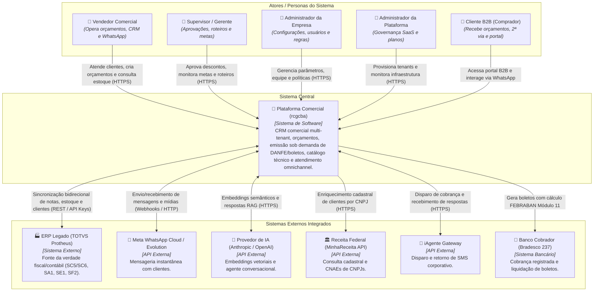

# Diagrama C4 — Nível 1: Contexto do Sistema

> Plataforma Comercial Multi-Tenant (rcgcba) no seu ecossistema corporativo.
> Escala de confiança: 🟢 CONFIRMADO

```mermaid
flowchart TD
    subgraph Pessoas ["Atores / Personas do Sistema"]
        VEND["👤 Vendedor Comercial<br/><i>(Opera orçamentos, CRM e WhatsApp)</i>"]
        SUP["👤 Supervisor / Gerente<br/><i>(Aprovações, roteiros e metas)</i>"]
        ADM_EMP["👤 Administrador da Empresa<br/><i>(Configurações, usuários e regras)</i>"]
        ADM_PLT["👤 Administrador da Plataforma<br/><i>(Governança SaaS e planos)</i>"]
        CLI_B2B["👤 Cliente B2B (Comprador)<br/><i>(Recebe orçamentos, 2ª via e portal)</i>"]
    end

    subgraph Sistema ["Sistema Central"]
        PLT["🏢 Plataforma Comercial (rcgcba)<br/><i>[Sistema de Software]</i><br/>CRM comercial multi-tenant, orçamentos, emissão sob demanda de DANFE/boletos, catálogo técnico e atendimento omnichannel."]
    end

    subgraph Externos ["Sistemas Externos Integrados"]
        ERP["🏭 ERP Legado (TOTVS Protheus)<br/><i>[Sistema Externo]</i><br/>Fonte da verdade fiscal/contábil (SC5/SC6, SA1, SE1, SF2)."]
        WPP["💬 Meta WhatsApp Cloud / Evolution<br/><i>[API Externa]</i><br/>Mensageria instantânea com clientes."]
        LLM["🧠 Provedor de IA (Anthropic / OpenAI)<br/><i>[API Externa]</i><br/>Embeddings vetoriais e agente conversacional."]
        REC["🏛️ Receita Federal (MinhaReceita API)<br/><i>[API Externa]</i><br/>Consulta cadastral e CNAEs de CNPJs."]
        SMS_GW["📱 iAgente Gateway<br/><i>[API Externa]</i><br/>Disparo e retorno de SMS corporativo."]
        BCO["🏦 Banco Cobrador (Bradesco 237)<br/><i>[Sistema Bancário]</i><br/>Cobrança registrada e liquidação de boletos."]
    end

    VEND -->|"Atende clientes, cria orçamentos e consulta estoque (HTTPS)"| PLT
    SUP -->|"Aprova descontos, monitora metas e roteiros (HTTPS)"| PLT
    ADM_EMP -->|"Gerencia parâmetros, equipe e políticas (HTTPS)"| PLT
    ADM_PLT -->|"Provisiona tenants e monitora infraestrutura (HTTPS)"| PLT
    CLI_B2B -->|"Acessa portal B2B e interage via WhatsApp"| PLT

    PLT <-->|"Sincronização bidirecional de notas, estoque e clientes (REST / API Keys)"| ERP
    PLT <-->|"Envio/recebimento de mensagens e mídias (Webhooks / HTTP)"| WPP
    PLT <-->|"Embeddings semânticos e respostas RAG (HTTPS)"| LLM
    PLT -->|"Enriquecimento cadastral de clientes por CNPJ (HTTPS)"| REC
    PLT <-->|"Disparo de cobrança e recebimento de respostas (HTTPS)"| SMS_GW
    PLT -->|"Gera boletos com cálculo FEBRABAN Módulo 11"| BCO
```

