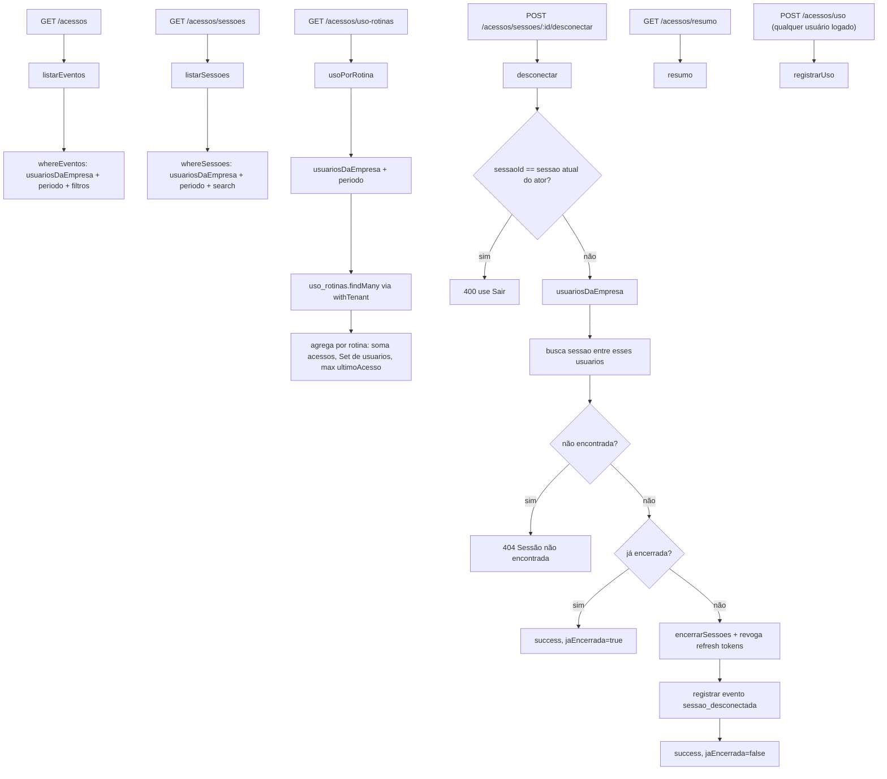
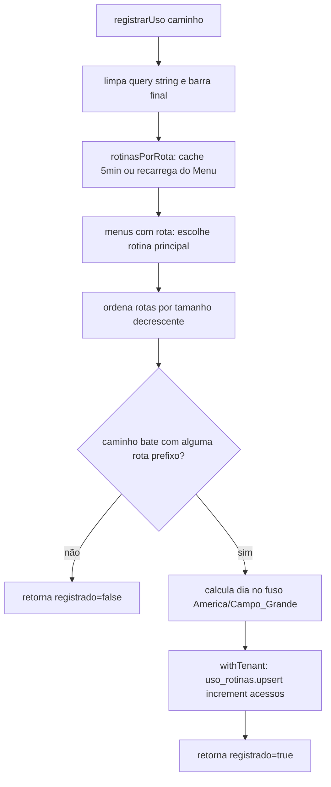
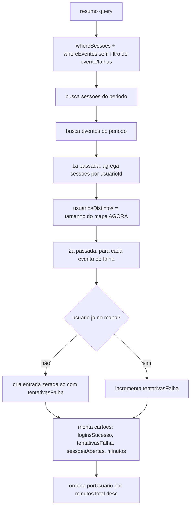
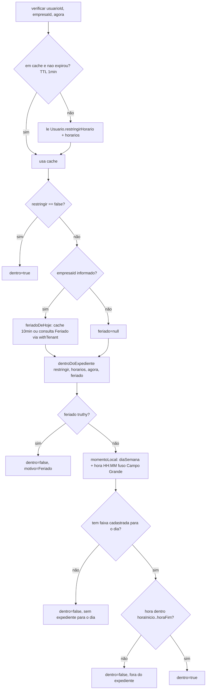

# Fluxograma — Módulo `acessos`

```mermaid
flowchart TD
    A["GET /acessos"] --> S1[listarEventos]
    B["GET /acessos/sessoes"] --> S2[listarSessoes]
    C["GET /acessos/uso-rotinas"] --> S3[usoPorRotina]
    D["POST /acessos/sessoes/:id/desconectar"] --> S4[desconectar]
    E["GET /acessos/resumo"] --> S5[resumo]
    F["POST /acessos/uso (qualquer usuário logado)"] --> S6[registrarUso]

    S1 --> T1[whereEventos: usuariosDaEmpresa + periodo + filtros]
    S2 --> T2[whereSessoes: usuariosDaEmpresa + periodo + search]
    S3 --> T3[usuariosDaEmpresa + periodo]
    T3 --> T4[uso_rotinas.findMany via withTenant]
    T4 --> T5[agrega por rotina: soma acessos, Set de usuarios, max ultimoAcesso]

    S4 --> U1{sessaoId == sessao atual do ator?}
    U1 -- sim --> X1[400 use Sair]
    U1 -- não --> U2[usuariosDaEmpresa]
    U2 --> U3[busca sessao entre esses usuarios]
    U3 --> U4{não encontrada?}
    U4 -- sim --> X2[404 Sessão não encontrada]
    U4 -- não --> U5{já encerrada?}
    U5 -- sim --> OK1["success, jaEncerrada=true"]
    U5 -- não --> U6[encerrarSessoes + revoga refresh tokens]
    U6 --> U7[registrar evento sessao_desconectada]
    U7 --> OK2["success, jaEncerrada=false"]
```

## `registrarUso` — detalhe

```mermaid
flowchart TD
    A[registrarUso caminho] --> B[limpa query string e barra final]
    B --> C[rotinasPorRota: cache 5min ou recarrega do Menu]
    C --> D[menus com rota: escolhe rotina principal]
    D --> E[ordena rotas por tamanho decrescente]
    E --> F{caminho bate com alguma rota prefixo?}
    F -- não --> G["retorna registrado=false"]
    F -- sim --> H[calcula dia no fuso America/Campo_Grande]
    H --> I[withTenant: uso_rotinas.upsert increment acessos]
    I --> J["retorna registrado=true"]
```

## `resumo` — agregação dupla

```mermaid
flowchart TD
    A[resumo query] --> B[whereSessoes + whereEventos sem filtro de evento/falhas]
    B --> C[busca sessoes do periodo]
    C --> D[busca eventos do periodo]
    D --> E[1a passada: agrega sessoes por usuarioId]
    E --> F[usuariosDistintos = tamanho do mapa AGORA]
    F --> G[2a passada: para cada evento de falha]
    G --> H{usuario ja no mapa?}
    H -- não --> I[cria entrada zerada so com tentativasFalha]
    H -- sim --> J[incrementa tentativasFalha]
    I --> K[monta cartoes: loginsSucesso, tentativasFalha, sessoesAbertas, minutos]
    J --> K
    K --> L[ordena porUsuario por minutosTotal desc]
```

## `HorarioTrabalhoService.verificar` — detalhe

```mermaid
flowchart TD
    A[verificar usuarioId, empresaId, agora] --> B{em cache e nao expirou? TTL 1min}
    B -- sim --> C[usa cache]
    B -- não --> D[le Usuario.restringirHorario + horarios]
    D --> C
    C --> E{restringir == false?}
    E -- sim --> F[dentro=true]
    E -- não --> G{empresaId informado?}
    G -- sim --> H[feriadoDeHoje: cache 10min ou consulta Feriado via withTenant]
    G -- não --> I[feriado=null]
    H --> J
    I --> J[dentroDoExpediente restringir, horarios, agora, feriado]
    J --> K{feriado truthy?}
    K -- sim --> L["dentro=false, motivo=Feriado"]
    K -- não --> M[momentoLocal: diaSemana + hora HH:MM fuso Campo Grande]
    M --> N{tem faixa cadastrada para o dia?}
    N -- não --> O["dentro=false, sem expediente para o dia"]
    N -- sim --> P{hora dentro horaInicio..horaFim?}
    P -- não --> Q["dentro=false, fora do expediente"]
    P -- sim --> R["dentro=true"]
```
