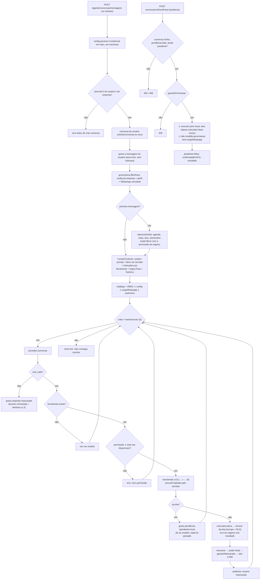

# Fluxograma — Módulo `agente`

```mermaid
flowchart TD
    U["POST /agente/conversas/mensagens (ou /stream)"] --> C0["config.paraUso (credencial em claro, em memória)"]
    C0 --> A0{"anexoId é do usuário e da empresa?"}
    A0 -- não --> E404[erro antes de criar conversa]
    A0 -- sim --> CV["conversa do usuário (minhaConversa) ou nova"]
    CV --> GM["grava a mensagem do usuário (texto livre, sem máscara)"]
    GM --> GOV["governanca.filtroPara: config da empresa + perfil + WhatsApp vinculado"]
    GOV --> AB{"primeira mensagem?"}
    AB -- sim --> MD["aberturaDoDia: agenda, meta, sino, aniversário<br/>(cada bloco com a permissão de origem)"]
    AB -- não --> CTX
    MD --> CTX["montarContexto: system prompt + bloco do servidor<br/>+ instruções por ferramenta + regras fixas + histórico"]
    CTX --> CAT["catálogo = RBAC ∧ config ∧ exigeWhatsapp ∧ usaAnexo"]
    CAT --> LOOP{"volta < maxIteracoes (5)"}
    LOOP -- sim --> PV[provedor.conversar]
    PV --> CH{"tool_calls?"}
    CH -- não --> FIN["grava resposta mascarada<br/>devolve remontada + destinos (≤ 2)"]
    CH -- sim --> T1{"ferramenta existe?"}
    T1 -- não --> ERR1[erro ao modelo]
    T1 -- sim --> T2{"permissão ∧ está nas disponíveis?"}
    T2 -- não --> ERR2["erro: sem permissão"]
    T2 -- sim --> T3["resolverIds («CLI:…» → id)<br/>anexoId injetado pelo servidor"]
    T3 --> T4{"escrita?"}
    T4 -- sim --> PEN["grava pendência (pendente=true)<br/>diz ao modelo: nada foi gravado"]
    T4 -- não --> LER["executarLeitura → service da tela (escopo + RLS)<br/>erro de negócio vira resultado"]
    LER --> MASK["mascarar → podar listas → garantirMascarado → teto 4.000"]
    MASK --> AUD["auditoria: resumo mascarado"]
    ERR1 & ERR2 & PEN & AUD --> LOOP
    LOOP -- "não" --> LIM["texto fixo: não consegui concluir"]

    CF["POST conversas/:id/confirmar/:pendencia"] --> CF1{"conversa minha, pendência dela, ainda pendente?"}
    CF1 -- não --> CFE[404 / 409]
    CF1 -- sim --> CF2{"garantirPermissao"}
    CF2 -- não --> CF403[403]
    CF2 -- sim --> CF3["⚠ executa (sem trava: dois cliques executam duas vezes)<br/>⚠ não revalida governança nem exigeWhatsapp"]
    CF3 --> CF4["pendente=false, confirmadaEm/Por, resultado"]
```
