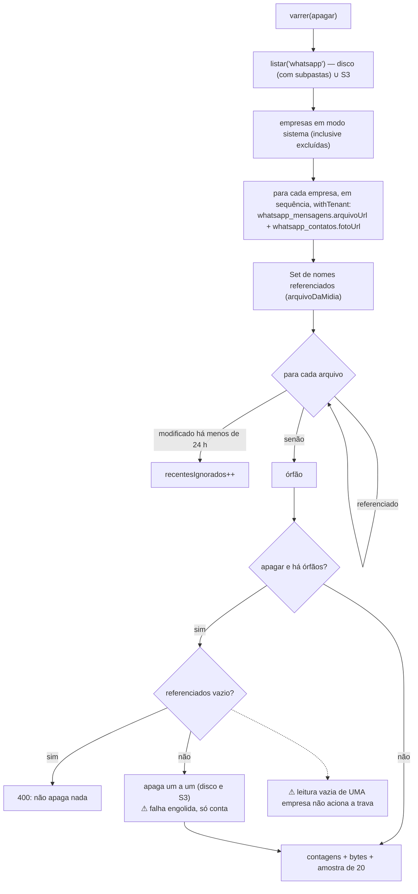

# Fluxograma — `MidiaOrfaService.varrer`

```mermaid
flowchart TD
    I["varrer(apagar)"] --> L["listar('whatsapp') — disco (com subpastas) ∪ S3"]
    L --> E["empresas em modo sistema (inclusive excluídas)"]
    E --> R["para cada empresa, em sequência, withTenant:<br/>whatsapp_mensagens.arquivoUrl + whatsapp_contatos.fotoUrl"]
    R --> N["Set de nomes referenciados (arquivoDaMidia)"]
    N --> F{"para cada arquivo"}
    F -- referenciado --> F
    F -- "modificado há menos de 24 h" --> REC["recentesIgnorados++"]
    F -- senão --> ORF["órfão"]
    ORF --> A{"apagar e há órfãos?"}
    A -- não --> RES
    A -- sim --> T{"referenciados vazio?"}
    T -- sim --> X["400: não apaga nada"]
    T -- não --> D["apaga um a um (disco e S3)<br/>⚠ falha engolida, só conta"]
    D --> RES["contagens + bytes + amostra de 20"]
    T -.-> W["⚠ leitura vazia de UMA empresa não aciona a trava"]
```
