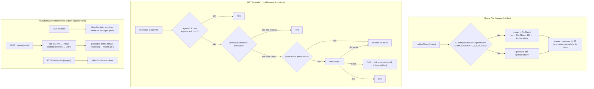

# Fluxograma — Módulo `armazenamento`

```mermaid
flowchart TD
    subgraph Grava["Gravar / ler / apagar (núcleo)"]
      G0["validarChave(chave)"] --> G1{"S3 configurado e 1º segmento em ARMAZENAMENTO_S3_PASTAS?"}
      G1 -- sim --> G2["gravar → PutObject<br/>ler → GetObject; 404 → tenta o disco"]
      G1 -- não --> G3["gravar/ler em uploads/chave"]
      G2 & G3 --> G4["apagar → remove do S3 (se a pasta está nele) e do disco"]
    end

    subgraph Serve["GET /uploads/... (middleware do main.ts)"]
      S0["normaliza o caminho"] --> S1{"agente/, fichas-importacao/, .tmp/?"}
      S1 -- sim --> S404[404]
      S1 -- não --> S2{"prefixo assinado ou backups/?"}
      S2 -- "sim, link inválido" --> S403[403]
      S2 -- "não / link válido" --> S3{"chave numa pasta do S3?"}
      S3 -- não --> SD[estático do disco]
      S3 -- sim --> S4["HeadObject"]
      S4 -- existe --> S302["302 → link pré-assinado (1 h, host público)"]
      S4 -- não existe --> SD
      S4 -- erro --> S502[502]
    end

    subgraph Admin["/plataforma/armazenamento (admin da plataforma)"]
      A1["GET situacao"] --> A1a["HeadBucket + arquivos ainda em disco por pasta"]
      A2["POST migrar {pasta}"] --> A2a["até 200: Put → Head confere tamanho → unlink"]
      A2a --> A2b["{copiados, bytes, falhas, restantes} — repetir até 0"]
      A3["POST midia-orfa {apagar}"] --> A3a["MidiaOrfaService.varrer"]
    end
```
