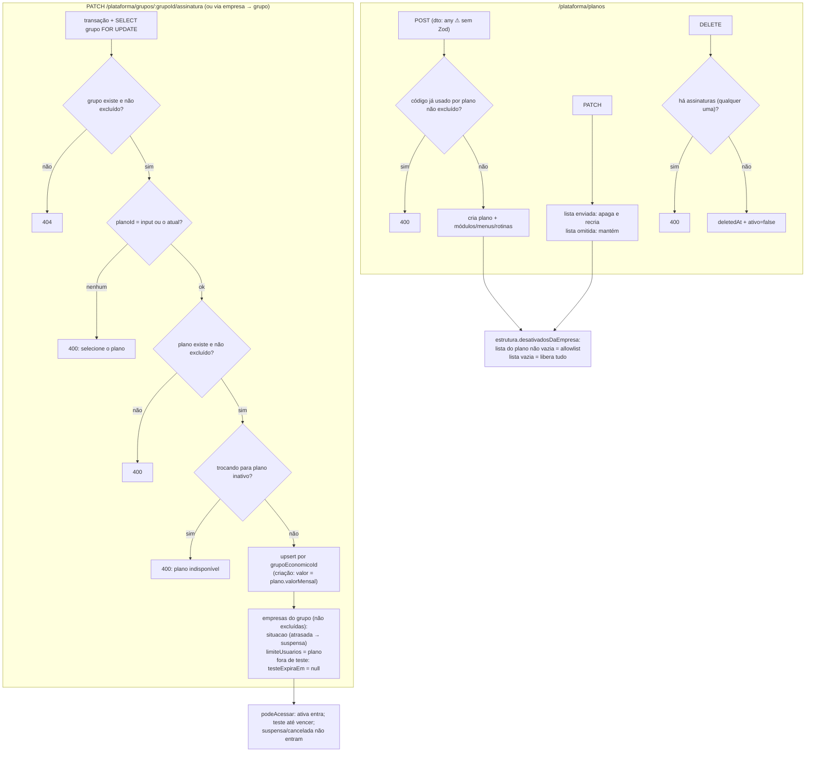

# Fluxograma — Módulos `assinaturas` e `planos`

```mermaid
flowchart TD
    subgraph Assinatura["PATCH /plataforma/grupos/:grupoId/assinatura (ou via empresa → grupo)"]
      A0["transação + SELECT grupo FOR UPDATE"] --> A1{"grupo existe e não excluído?"}
      A1 -- não --> A404[404]
      A1 -- sim --> A2{"planoId = input ou o atual?"}
      A2 -- nenhum --> A400a["400: selecione o plano"]
      A2 -- ok --> A3{"plano existe e não excluído?"}
      A3 -- não --> A400b[400]
      A3 -- sim --> A4{"trocando para plano inativo?"}
      A4 -- sim --> A400c["400: plano indisponível"]
      A4 -- não --> A5["upsert por grupoEconomicoId<br/>(criação: valor = plano.valorMensal)"]
      A5 --> A6["empresas do grupo (não excluídas):<br/>situacao (atrasada → suspensa)<br/>limiteUsuarios = plano<br/>fora de teste: testeExpiraEm = null"]
    end

    A6 --> ACC["podeAcessar: ativa entra; teste até vencer;<br/>suspensa/cancelada não entram"]

    subgraph Planos["/plataforma/planos"]
      P1["POST (dto: any ⚠ sem Zod)"] --> P1a{"código já usado por plano não excluído?"}
      P1a -- sim --> P400[400]
      P1a -- não --> P1b["cria plano + módulos/menus/rotinas"]
      P2["PATCH"] --> P2a["lista enviada: apaga e recria<br/>lista omitida: mantém"]
      P3["DELETE"] --> P3a{"há assinaturas (qualquer uma)?"}
      P3a -- sim --> P400b[400]
      P3a -- não --> P3b["deletedAt + ativo=false"]
    end

    P1b & P2a --> EST["estrutura.desativadosDaEmpresa:<br/>lista do plano não vazia = allowlist<br/>lista vazia = libera tudo"]
```
