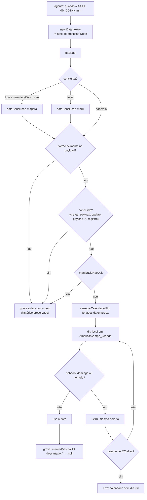

# Fluxograma — `AtividadesService.create` / `update` (vencimento e conclusão)

```mermaid
flowchart TD
    I[payload] --> NC{concluida?}
    NC -- "true e sem dataConclusao" --> NC1[dataConclusao = agora]
    NC -- "false" --> NC2[dataConclusao = null]
    NC -- "não veio" --> V
    NC1 --> V
    NC2 --> V

    V{"dataVencimento no payload?"}
    V -- não --> GRAVA
    V -- sim --> V1{"concluída?<br/>(create: payload; update: payload ?? registro)"}
    V1 -- sim --> GRAVA["grava a data como veio<br/>(histórico preservado)"]
    V1 -- não --> V2{manterDiaNaoUtil?}
    V2 -- sim --> GRAVA
    V2 -- não --> K[carregarCalendarioUtil: feriados da empresa]
    K --> A1["dia local em America/Campo_Grande"]
    A1 --> A2{"sábado, domingo ou feriado?"}
    A2 -- não --> A4[usa a data]
    A2 -- sim --> A3["+24h, mesmo horário"]
    A3 --> A5{passou de 370 dias?}
    A5 -- sim --> ERR[erro: calendário sem dia útil]
    A5 -- não --> A1
    A4 --> GRAVA2["grava; manterDiaNaoUtil descartado; '' → null"]

    AG["agente: quando = AAAA-MM-DDTHH:mm"] --> AG1["new Date(texto)<br/>⚠ fuso do processo Node"] --> I
```
