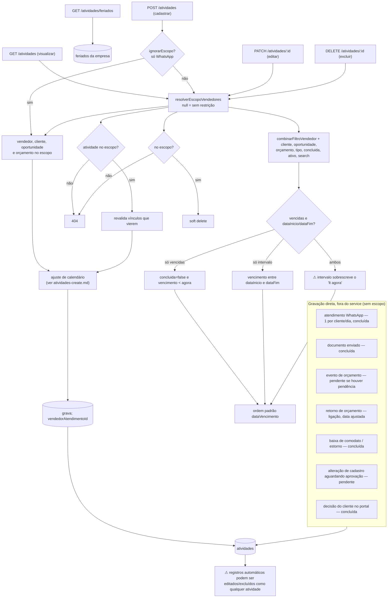

# Fluxograma — Módulo `atividades`

```mermaid
flowchart TD
    E["resolverEscopoVendedores<br/>null = sem restrição"]

    L["GET /atividades (visualizar)"] --> E
    E --> L1["combinarFiltroVendedor + cliente, oportunidade,<br/>orçamento, tipo, concluida, ativo, search"]
    L1 --> L2{"vencidas e dataInicio/dataFim?"}
    L2 -- só vencidas --> L3["concluida=false e vencimento < agora"]
    L2 -- só intervalo --> L4["vencimento entre dataInicio e dataFim"]
    L2 -- ambos --> L5["⚠ intervalo sobrescreve o 'lt agora'"]
    L3 & L4 & L5 --> L6["ordem padrão dataVencimento"]

    F["GET /atividades/feriados"] --> F1[(feriados da empresa)]

    C["POST /atividades (cadastrar)"] --> C0{ignorarEscopo?<br/>só WhatsApp}
    C0 -- sim --> CV
    C0 -- não --> E
    E --> CV["vendedor, cliente, oportunidade<br/>e orçamento no escopo"]
    CV --> CAL["ajuste de calendário<br/>(ver atividades-create.md)"]
    CAL --> G[(grava; vendedorAtendimentoId)]

    U["PATCH /atividades/:id (editar)"] --> E
    E --> U1{atividade no escopo?}
    U1 -- não --> N404[404]
    U1 -- sim --> U2[revalida vínculos que vierem] --> CAL

    D["DELETE /atividades/:id (excluir)"] --> E
    E --> D1{no escopo?}
    D1 -- não --> N404
    D1 -- sim --> D2[soft delete]

    subgraph Diretos["Gravação direta, fora do service (sem escopo)"]
      R1["atendimento WhatsApp — 1 por cliente/dia, concluída"]
      R2["documento enviado — concluída"]
      R3["evento de orçamento — pendente se houver pendência"]
      R4["retorno de orçamento — ligação, data ajustada"]
      R5["baixa de comodato / estorno — concluída"]
      R6["alteração de cadastro aguardando aprovação — pendente"]
      R7["decisão do cliente no portal — concluída"]
    end
    Diretos --> AT[(atividades)]
    G --> AT
    AT --> W["⚠ registros automáticos podem ser<br/>editados/excluídos como qualquer atividade"]
```
