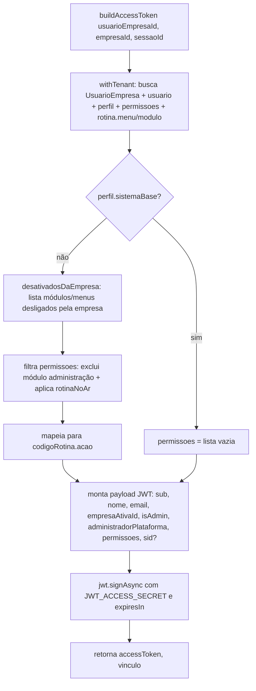
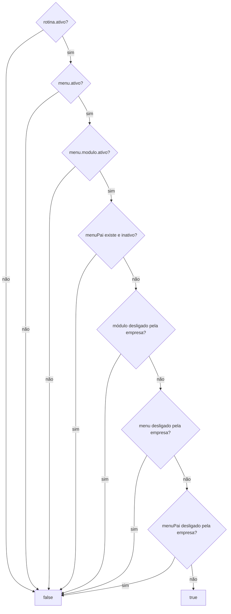

# Fluxograma de função — `AuthService.buildAccessToken` (privado)

```mermaid
flowchart TD
    Start[buildAccessToken usuarioEmpresaId, empresaId, sessaoId] --> F1[withTenant: busca UsuarioEmpresa + usuario + perfil + permissoes + rotina.menu/modulo]
    F1 --> F2{perfil.sistemaBase?}
    F2 -- sim --> F3[permissoes = lista vazia]
    F2 -- não --> F4[desativadosDaEmpresa: lista módulos/menus desligados pela empresa]
    F4 --> F5[filtra permissoes: exclui módulo administração + aplica rotinaNoAr]
    F5 --> F6[mapeia para codigoRotina.acao]
    F6 --> F7
    F3 --> F7[monta payload JWT: sub, nome, email, empresaAtivaId, isAdmin, administradorPlataforma, permissoes, sid?]
    F7 --> F8[jwt.signAsync com JWT_ACCESS_SECRET e expiresIn]
    F8 --> End[retorna accessToken, vinculo]
```

## Sub-função `rotinaNoAr(rotina, daEmpresa)`

```mermaid
flowchart TD
    R1{rotina.ativo?} -- não --> RF[false]
    R1 -- sim --> R2{menu.ativo?}
    R2 -- não --> RF
    R2 -- sim --> R3{menu.modulo.ativo?}
    R3 -- não --> RF
    R3 -- sim --> R4{menuPai existe e inativo?}
    R4 -- sim --> RF
    R4 -- não --> R5{módulo desligado pela empresa?}
    R5 -- sim --> RF
    R5 -- não --> R6{menu desligado pela empresa?}
    R6 -- sim --> RF
    R6 -- não --> R7{menuPai desligado pela empresa?}
    R7 -- sim --> RF
    R7 -- não --> RT[true]
```
