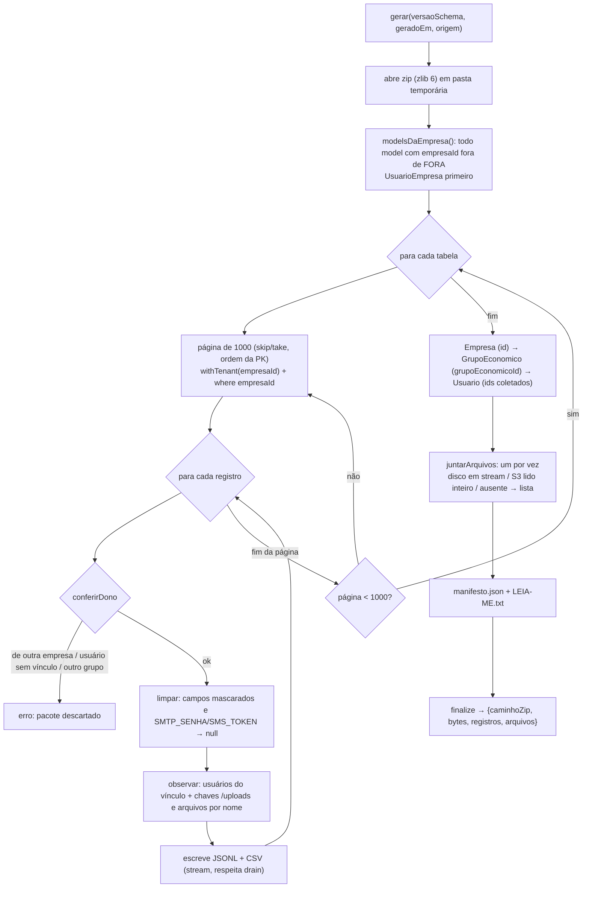

# Fluxograma — `BackupGerador.gerar`

```mermaid
flowchart TD
    I["gerar(versaoSchema, geradoEm, origem)"] --> Z["abre zip (zlib 6) em pasta temporária"]
    Z --> M["modelsDaEmpresa(): todo model com empresaId fora de FORA<br/>UsuarioEmpresa primeiro"]
    M --> T{"para cada tabela"}
    T --> P["página de 1000 (skip/take, ordem da PK)<br/>withTenant(empresaId) + where empresaId"]
    P --> R{"para cada registro"}
    R --> D{"conferirDono"}
    D -- "de outra empresa / usuário sem vínculo / outro grupo" --> X["erro: pacote descartado"]
    D -- ok --> L["limpar: campos mascarados e SMTP_SENHA/SMS_TOKEN → null"]
    L --> O["observar: usuários do vínculo + chaves /uploads e arquivos por nome"]
    O --> W["escreve JSONL + CSV (stream, respeita drain)"]
    W --> R
    R -- fim da página --> P2{"página < 1000?"}
    P2 -- não --> P
    P2 -- sim --> T
    T -- fim --> E["Empresa (id) → GrupoEconomico (grupoEconomicoId) → Usuario (ids coletados)"]
    E --> A["juntarArquivos: um por vez<br/>disco em stream / S3 lido inteiro / ausente → lista"]
    A --> MF["manifesto.json + LEIA-ME.txt"]
    MF --> FIN["finalize → {caminhoZip, bytes, registros, arquivos}"]
```
