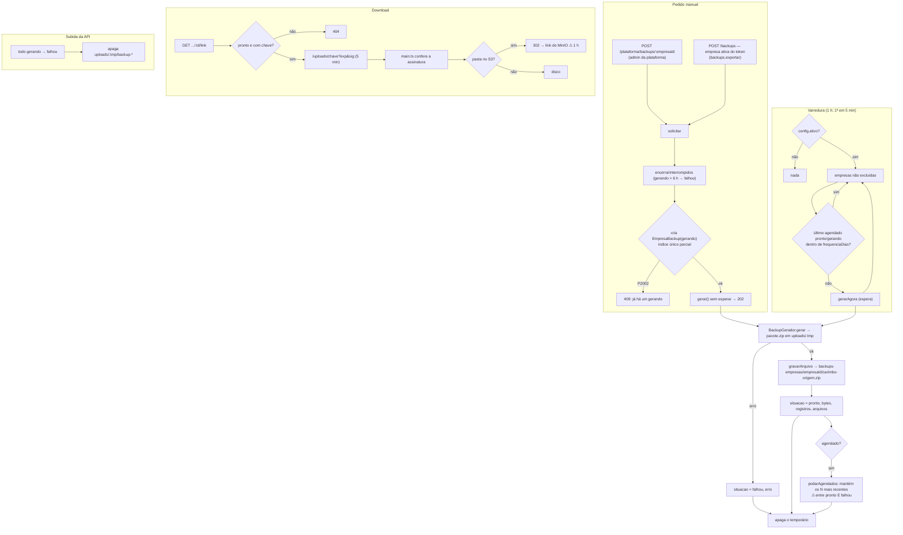

# Fluxograma — Módulo `backup-empresa`

```mermaid
flowchart TD
    subgraph Pedido["Pedido manual"]
      P1["POST /plataforma/backups/:empresaId<br/>(admin da plataforma)"] --> SOL
      P2["POST /backups — empresa ativa do token<br/>(backups.exportar)"] --> SOL
      SOL["solicitar"] --> INT["encerrarInterrompidos (gerando > 6 h → falhou)"]
      INT --> REG{"cria EmpresaBackup(gerando)<br/>índice único parcial"}
      REG -- P2002 --> C409["409: já há um gerando"]
      REG -- ok --> BG["gerar() sem esperar → 202"]
    end

    subgraph Agenda["Varredura (1 h; 1ª em 5 min)"]
      V0{"config.ativo?"} -- não --> V0x[nada]
      V0 -- sim --> V1["empresas não excluídas"]
      V1 --> V2{"último agendado pronto/gerando<br/>dentro de frequenciaDias?"}
      V2 -- sim --> V1
      V2 -- não --> V3["gerarAgora (espera)"] --> V1
    end

    BG & V3 --> G["BackupGerador.gerar → pacote.zip em uploads/.tmp"]
    G -- erro --> F["situacao = falhou, erro"]
    G -- ok --> GR["gravarArquivo → backups-empresas/empresaId/carimbo-origem.zip"]
    GR --> PR["situacao = pronto, bytes, registros, arquivos"]
    PR --> AG{"agendado?"}
    AG -- sim --> POD["podarAgendados: mantém os N mais recentes<br/>⚠ entre pronto E falhou"]
    F & PR & POD --> TMP["apaga o temporário"]

    subgraph Baixar["Download"]
      L1["GET .../:id/link"] --> L2{"pronto e com chave?"}
      L2 -- não --> L404[404]
      L2 -- sim --> L3["/uploads/chave?exp&sig (5 min)"]
      L3 --> L4["main.ts confere a assinatura"]
      L4 --> L5{"pasta no S3?"}
      L5 -- sim --> L6["302 → link do MinIO ⚠ 1 h"]
      L5 -- não --> L7[disco]
    end

    subgraph Boot["Subida da API"]
      B1["todo gerando → falhou"] --> B2["apaga uploads/.tmp/backup-*"]
    end
```
