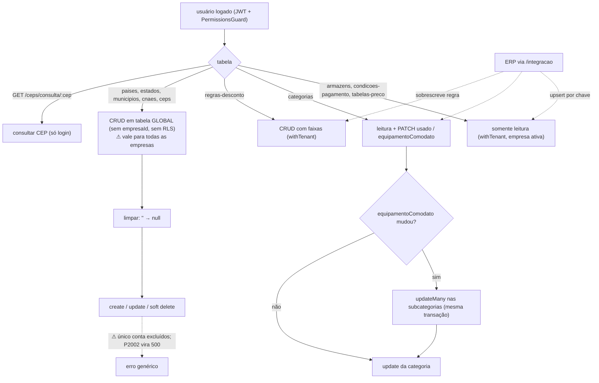
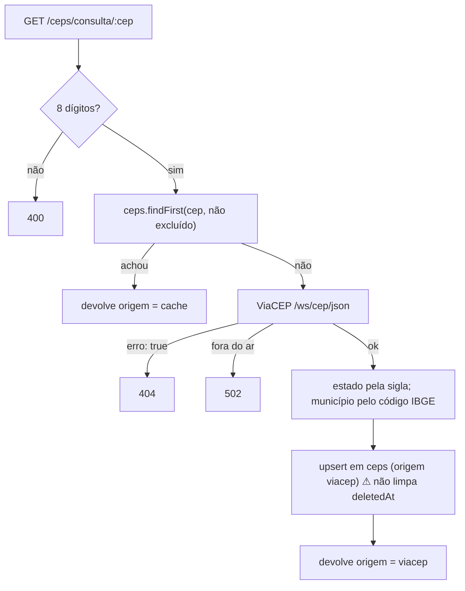

# Fluxograma — Módulo `cadastros`

```mermaid
flowchart TD
    U["usuário logado (JWT + PermissionsGuard)"] --> G{"tabela"}

    G -->|"armazens, condicoes-pagamento, tabelas-preco"| R1["somente leitura (withTenant, empresa ativa)"]
    G -->|"categorias"| C1["leitura + PATCH usado / equipamentoComodato"]
    G -->|"regras-desconto"| RD["CRUD com faixas (withTenant)"]
    G -->|"paises, estados, municipios, cnaes, ceps"| GL["CRUD em tabela GLOBAL (sem empresaId, sem RLS)<br/>⚠ vale para todas as empresas"]
    G -->|"GET /ceps/consulta/:cep"| CEP["consultar CEP (só login)"]

    ERP["ERP via /integracao"] -.->|"upsert por chave"| R1
    ERP -.-> C1
    ERP -.->|"sobrescreve regra"| RD

    C1 --> C2{"equipamentoComodato mudou?"}
    C2 -- sim --> C3["updateMany nas subcategorias (mesma transação)"]
    C2 -- não --> C4["update da categoria"]
    C3 --> C4

    GL --> L1["limpar: '' → null"] --> L2["create / update / soft delete"]
    L2 -. "⚠ único conta excluídos; P2002 vira 500" .-> ERR[erro genérico]
```

```mermaid
flowchart TD
    A["GET /ceps/consulta/:cep"] --> B{"8 dígitos?"}
    B -- não --> X400[400]
    B -- sim --> C["ceps.findFirst(cep, não excluído)"]
    C -- achou --> HIT["devolve origem = cache"]
    C -- não --> D["ViaCEP /ws/cep/json"]
    D -- "erro: true" --> X404[404]
    D -- "fora do ar" --> X502[502]
    D -- ok --> E["estado pela sigla; município pelo código IBGE"]
    E --> F["upsert em ceps (origem viacep) ⚠ não limpa deletedAt"]
    F --> G["devolve origem = viacep"]
```
