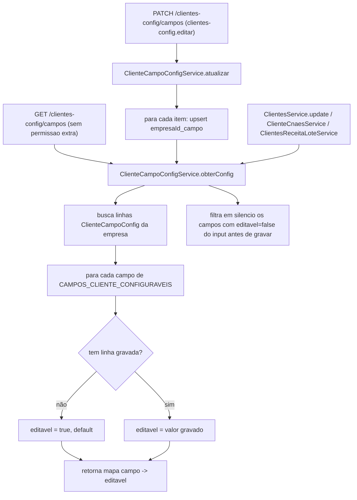

# Fluxograma — Módulo `cliente-campo-config`

```mermaid
flowchart TD
    A["GET /clientes-config/campos (sem permissao extra)"] --> S1[ClienteCampoConfigService.obterConfig]
    S1 --> F1[busca linhas ClienteCampoConfig da empresa]
    F1 --> F2[para cada campo de CAMPOS_CLIENTE_CONFIGURAVEIS]
    F2 --> F3{tem linha gravada?}
    F3 -- não --> F4[editavel = true, default]
    F3 -- sim --> F5[editavel = valor gravado]
    F4 --> R1[retorna mapa campo -> editavel]
    F5 --> R1

    B["PATCH /clientes-config/campos (clientes-config.editar)"] --> S2[ClienteCampoConfigService.atualizar]
    S2 --> F6[para cada item: upsert empresaId_campo]
    F6 --> S1

    C["ClientesService.update / ClienteCnaesService / ClientesReceitaLoteService"] --> S1
    S1 --> F7[filtra em silencio os campos com editavel=false do input antes de gravar]
```
