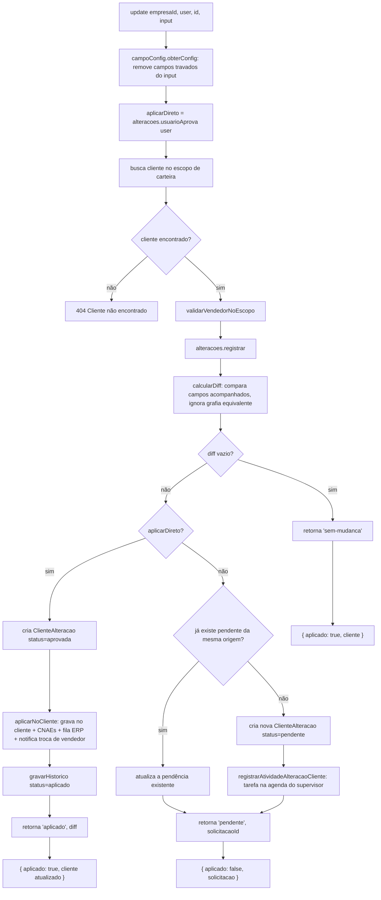

# Fluxograma de função — `ClientesService.update` + `ClienteAlteracoesService.registrar`

```mermaid
flowchart TD
    Start[update empresaId, user, id, input] --> F1[campoConfig.obterConfig: remove campos travados do input]
    F1 --> F2[aplicarDireto = alteracoes.usuarioAprova user]
    F2 --> F3[busca cliente no escopo de carteira]
    F3 --> F4{cliente encontrado?}
    F4 -- não --> X1[404 Cliente não encontrado]
    F4 -- sim --> F5[validarVendedorNoEscopo]
    F5 --> F6[alteracoes.registrar]
    F6 --> F7[calcularDiff: compara campos acompanhados, ignora grafia equivalente]
    F7 --> F8{diff vazio?}
    F8 -- sim --> R1["retorna 'sem-mudanca'"]
    F8 -- não --> F9{aplicarDireto?}
    F9 -- sim --> F10[cria ClienteAlteracao status=aprovada]
    F10 --> F11[aplicarNoCliente: grava no cliente + CNAEs + fila ERP + notifica troca de vendedor]
    F11 --> F12[gravarHistorico status=aplicado]
    F12 --> R2["retorna 'aplicado', diff"]
    F9 -- não --> F13{já existe pendente da mesma origem?}
    F13 -- sim --> F14[atualiza a pendência existente]
    F13 -- não --> F15[cria nova ClienteAlteracao status=pendente]
    F15 --> F16[registrarAtividadeAlteracaoCliente: tarefa na agenda do supervisor]
    F14 --> R3["retorna 'pendente', solicitacaoId"]
    F16 --> R3
    R1 --> End1["{ aplicado: true, cliente }"]
    R2 --> End2["{ aplicado: true, cliente atualizado }"]
    R3 --> End3["{ aplicado: false, solicitacao }"]
```
