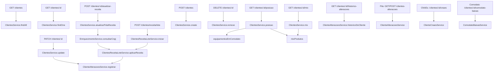

# Fluxograma — Módulo `clientes`

```mermaid
flowchart TD
    A["GET /clientes"] --> S1[ClientesService.findAll]
    B["GET /clientes/:id"] --> S2[ClientesService.findOne]
    C["GET /clientes/:id/posicao"] --> S3[ClientesService.posicao]
    D["GET /clientes/:id/mix"] --> S4[ClientesService.mix]
    E["POST /clientes"] --> S5[ClientesService.create]
    F["PATCH /clientes/:id"] --> S6[ClientesService.update]
    G["DELETE /clientes/:id"] --> S7[ClientesService.remove]
    H["POST /clientes/:id/atualizar-receita"] --> S8[ClientesService.atualizarPelaReceita]
    I["POST /clientes/receita/lote"] --> S9[ClientesReceitaLoteService.iniciar]
    J["GET /clientes/:id/historico-alteracoes"] --> S10[ClienteAlteracoesService.historicoDoCliente]
    K["Fila: GET/POST /clientes-alteracoes"] --> S11[ClienteAlteracoesService]
    L["CNAEs: /clientes/:id/cnaes"] --> S12[ClienteCnaesService]
    M["Comodato: /clientes/:id/comodato-baixas"] --> S13[ComodatoBaixasService]

    S6 --> F1[ClienteAlteracoesService.registrar]
    S8 --> F2[EnriquecimentoService.consultarCnpj]
    F2 --> F3[ClientesReceitaLoteService.aplicarReceita]
    F3 --> F1
    S9 --> F3
    S3 --> F4[equipamentosEmComodato]
    S3 --> F5[mixProdutos]
    S4 --> F5
```
