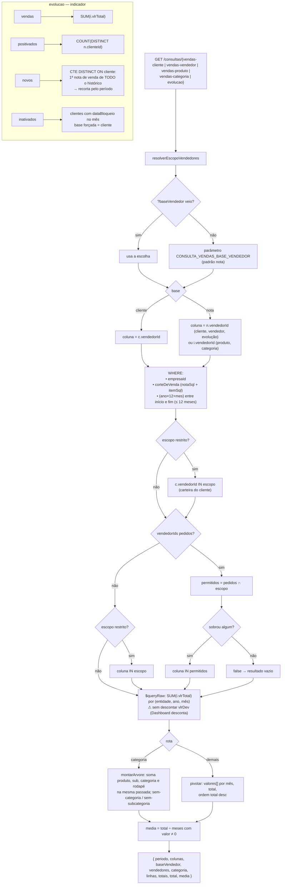

# Fluxograma — Módulo `consultas`

```mermaid
flowchart TD
    R["GET /consultas/{vendas-cliente | vendas-vendedor | vendas-produto |<br/>vendas-categoria | evolucao}"] --> E[resolverEscopoVendedores]
    E --> B{"?baseVendedor veio?"}
    B -- sim --> B1[usa a escolha]
    B -- não --> B2["parâmetro CONSULTA_VENDAS_BASE_VENDEDOR<br/>(padrão nota)"]
    B1 & B2 --> COL{"base"}
    COL -- cliente --> CC["coluna = c.vendedorId"]
    COL -- nota --> CN["coluna = n.vendedorId (cliente, vendedor, evolução)<br/>ou i.vendedorId (produto, categoria)"]

    CC & CN --> W["WHERE:<br/>• empresaId<br/>• corteDeVenda (notaSql + itemSql)<br/>• (ano×12+mes) entre início e fim (≤ 12 meses)"]
    W --> T1{"escopo restrito?"}
    T1 -- não --> F
    T1 -- sim --> T2["c.vendedorId IN escopo<br/>(carteira do cliente)"]
    T2 --> F{"vendedorIds pedidos?"}
    F -- não --> F1{"escopo restrito?"}
    F1 -- sim --> F2["coluna IN escopo"]
    F1 -- não --> Q
    F -- sim --> F3["permitidos = pedidos ∩ escopo"]
    F3 --> F4{"sobrou algum?"}
    F4 -- não --> F5["false → resultado vazio"]
    F4 -- sim --> F6["coluna IN permitidos"]
    F2 & F6 --> Q
    F5 --> Q

    Q["$queryRaw: SUM(i.vlrTotal) por (entidade, ano, mês)<br/>⚠ sem descontar vlrDev (Dashboard desconta)"] --> P{"rota"}
    P -- categoria --> AR["montarArvore: soma produto, sub, categoria e rodapé<br/>na mesma passada; sem-categoria / sem-subcategoria"]
    P -- demais --> PV["pivotar: valores[] por mês, total,<br/>ordem total desc"]
    AR & PV --> MD["media = total ÷ meses com valor ≠ 0"]
    MD --> OUT["{ periodo, colunas, baseVendedor, vendedores, categoria, linhas, totais, total, media }"]

    subgraph Evo["evolucao — indicador"]
      I1[vendas] --> S1["SUM(i.vlrTotal)"]
      I2[positivados] --> S2["COUNT(DISTINCT n.clienteId)"]
      I3[novos] --> S3["CTE DISTINCT ON cliente:<br/>1ª nota de venda de TODO o histórico<br/>→ recorta pelo período"]
      I4[inativados] --> S4["clientes com dataBloqueio no mês<br/>base forçada = cliente"]
    end
```
