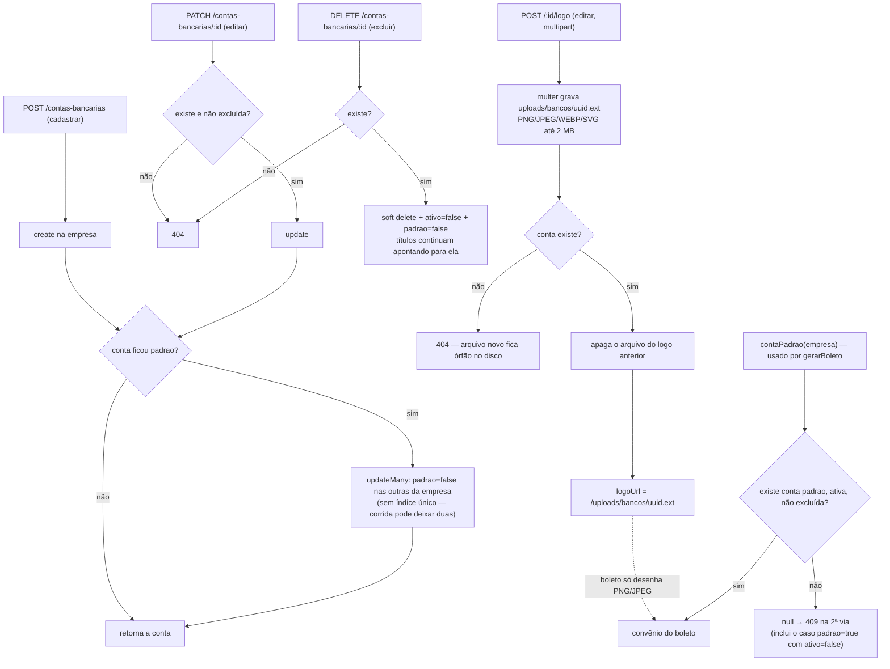

# Fluxograma — Módulo `contas-bancarias`

```mermaid
flowchart TD
    C["POST /contas-bancarias (cadastrar)"] --> C1[create na empresa]
    U["PATCH /contas-bancarias/:id (editar)"] --> U0{existe e não excluída?}
    U0 -- não --> N404[404]
    U0 -- sim --> U1[update]
    C1 & U1 --> P{"conta ficou padrao?"}
    P -- sim --> P1["updateMany: padrao=false nas outras da empresa<br/>(sem índice único — corrida pode deixar duas)"]
    P -- não --> R[retorna a conta]
    P1 --> R

    D["DELETE /contas-bancarias/:id (excluir)"] --> D0{existe?}
    D0 -- não --> N404
    D0 -- sim --> D1["soft delete + ativo=false + padrao=false<br/>títulos continuam apontando para ela"]

    L["POST /:id/logo (editar, multipart)"] --> L0["multer grava uploads/bancos/uuid.ext<br/>PNG/JPEG/WEBP/SVG até 2 MB"]
    L0 --> L1{conta existe?}
    L1 -- não --> L404["404 — arquivo novo fica órfão no disco"]
    L1 -- sim --> L2[apaga o arquivo do logo anterior]
    L2 --> L3["logoUrl = /uploads/bancos/uuid.ext"]
    L3 -. "boleto só desenha PNG/JPEG" .-> B

    CP["contaPadrao(empresa) — usado por gerarBoleto"] --> CP1{"existe conta padrao, ativa, não excluída?"}
    CP1 -- não --> CP2["null → 409 na 2ª via<br/>(inclui o caso padrao=true com ativo=false)"]
    CP1 -- sim --> B[convênio do boleto]
```
