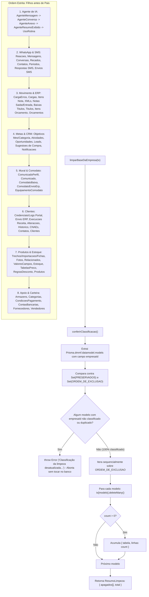

# Fluxograma — Algoritmo `demo-limpeza` (Limpeza da Base de Negócio)

```mermaid
flowchart TD
    START["limparBaseDaEmpresa(tx)"] --> DMMF["conferirClassificacao()"]
    DMMF --> GET_MODELS["Extrai Prisma.dmmf.datamodel.models com campo empresaId"]
    GET_MODELS --> SETS["Compara contra Set(PRESERVADOS) e Set(ORDEM_DE_EXCLUSAO)"]
    
    SETS --> CHK{"Algum modelo com empresaId não classificado ou duplicado?"}
    CHK -- "Sim" --> ABORT["throw Error ('Classificação da limpeza desatualizada...') - Aborta sem tocar no banco"]
    CHK -- "Não (100% classificado)" --> LOOP["Itera sequencialmente sobre ORDEM_DE_EXCLUSAO"]
    
    subgraph OrdemExclusao ["Ordem Estrita: Filhos antes de Pais"]
        direction TB
        E1["1. Agente de IA: AgenteMensagem -> AgenteConversa -> AgenteAnexo -> AgenteResumoExibido -> UsoRotina"]
        E2["2. WhatsApp & SMS: Reacoes, Mensagens, Conversas, Recados, Contatos, Periodos, Respostas SMS, Envios SMS"]
        E3["3. Movimento & ERP: CargaErros, Cargas, Itens Nota, XMLs, Notas Saida/Entrada, Baixas Titulos, Titulos, Itens Orcamento, Orcamentos"]
        E4["4. Metas & CRM: Objetivos Mes/Categoria, Atividades, Oportunidades, Leads, Sugestoes de Compra, Notificacoes"]
        E5["5. Mural & Comodato: ComunicadoPerfil, Comunicado, ComodatoBaixa, ComodatoEnvioErp, EquipamentoComodato"]
        E6["6. Clientes: Credenciais/Logs Portal, Envio ERP, Execucoes Receita, Alteracoes, Historico, CNAEs, Contatos, Clientes"]
        E7["7. Produtos & Estoque: Trechos/Importacoes/Fichas, Fotos, Relacionados, ValoresCampos, Estoque, TabelasPreco, RegrasDesconto, Produtos"]
        E8["8. Apoio & Carteira: Armazens, Categorias, CondicoesPagamento, ContasBancarias, Fornecedores, Vendedores"]
        E1 --> E2 --> E3 --> E4 --> E5 --> E6 --> E7 --> E8
    end
    
    LOOP --> EXEC["Para cada modelo: tx[modelo].deleteMany()"]
    EXEC --> CNT{"count > 0?"}
    CNT -- "Sim" --> ACC["Acumula { tabela, linhas: count }"]
    CNT -- "Não" --> NEXT["Próximo modelo"]
    ACC --> NEXT
    
    NEXT --> DONE["Retorna ResumoLimpeza: { apagados[], total }"]
```

