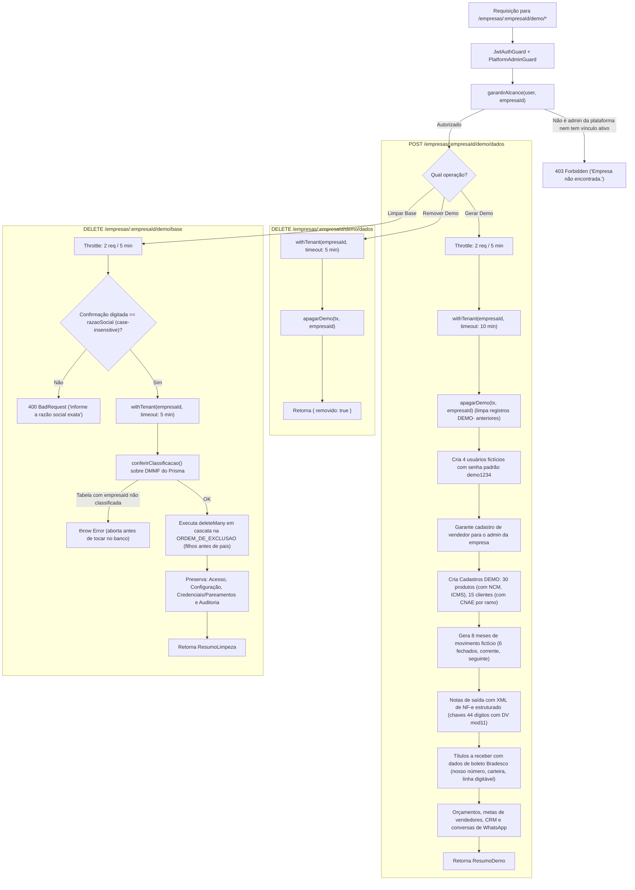

# Fluxograma — Módulo `demo`

```mermaid
flowchart TD
    REQ["Requisição para /empresas/:empresaId/demo/*"] --> GAUTH["JwtAuthGuard + PlatformAdminGuard"]
    GAUTH --> GA["garantirAlcance(user, empresaId)"]
    GA -- "Não é admin da plataforma nem tem vínculo ativo" --> FORB["403 Forbidden ('Empresa não encontrada.')"]
    GA -- "Autorizado" --> ROTA{"Qual operação?"}

    subgraph Gerar ["POST /empresas/:empresaId/demo/dados"]
        ROTA -- "Gerar Demo" --> THR1["Throttle: 2 req / 5 min"]
        THR1 --> WTG["withTenant(empresaId, timeout: 10 min)"]
        WTG --> DELD["apagarDemo(tx, empresaId) (limpa registros DEMO- anteriores)"]
        DELD --> CRU["Cria 4 usuários fictícios com senha padrão demo1234"]
        CRU --> VEND["Garante cadastro de vendedor para o admin da empresa"]
        VEND --> CAD["Cria Cadastros DEMO: 30 produtos (com NCM, ICMS), 15 clientes (com CNAE por ramo)"]
        CAD --> MOV["Gera 8 meses de movimento fictício (6 fechados, corrente, seguinte)"]
        MOV --> NF["Notas de saída com XML de NF-e estruturado (chaves 44 dígitos com DV mod11)"]
        NF --> TIT["Títulos a receber com dados de boleto Bradesco (nosso número, carteira, linha digitável)"]
        TIT --> CRM["Orçamentos, metas de vendedores, CRM e conversas de WhatsApp"]
        CRM --> RETG["Retorna ResumoDemo"]
    end

    subgraph Remover ["DELETE /empresas/:empresaId/demo/dados"]
        ROTA -- "Remover Demo" --> WTR["withTenant(empresaId, timeout: 5 min)"]
        WTR --> DELR["apagarDemo(tx, empresaId)"]
        DELR --> RETR["Retorna { removido: true }"]
    end

    subgraph LimparBase ["DELETE /empresas/:empresaId/demo/base"]
        ROTA -- "Limpar Base" --> THR2["Throttle: 2 req / 5 min"]
        THR2 --> VALC{"Confirmação digitada == razaoSocial (case-insensitive)?"}
        VALC -- "Não" --> BR["400 BadRequest ('informe a razão social exata')"]
        VALC -- "Sim" --> WTL["withTenant(empresaId, timeout: 5 min)"]
        WTL --> CLAS["conferirClassificacao() sobre DMMF do Prisma"]
        CLAS -- "Tabela com empresaId não classificada" --> ERR["throw Error (aborta antes de tocar no banco)"]
        CLAS -- "OK" --> WIPE["Executa deleteMany em cascata na ORDEM_DE_EXCLUSAO (filhos antes de pais)"]
        WIPE --> PREV["Preserva: Acesso, Configuração, Credenciais/Pareamentos e Auditoria"]
        PREV --> RETL["Retorna ResumoLimpeza"]
    end
```

