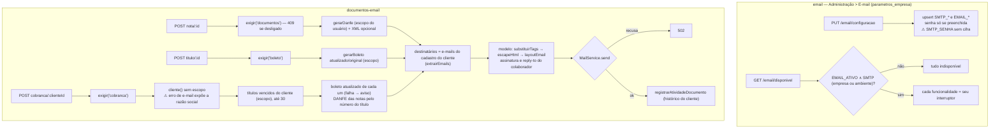

# Fluxograma — Módulos `email` e `documentos-email`

```mermaid
flowchart TD
    subgraph Config["email — Administração > E-mail (parametros_empresa)"]
      C1["PUT /email/configuracao"] --> C2["upsert SMTP_* e EMAIL_*<br/>senha só se preenchida<br/>⚠ SMTP_SENHA sem cifra"]
      D1["GET /email/disponivel"] --> D2{"EMAIL_ATIVO ∧ SMTP (empresa ou ambiente)?"}
      D2 -- não --> D3[tudo indisponível]
      D2 -- sim --> D4["cada funcionalidade = seu interruptor"]
    end

    subgraph Envio["documentos-email"]
      N["POST nota/:id"] --> X1["exigir('documentos') — 409 se desligado"]
      B["POST titulo/:id"] --> X2["exigir('boleto')"]
      K["POST cobranca/:clienteId"] --> X3["exigir('cobranca')"]
      X1 --> N1["gerarDanfe (escopo do usuário) + XML opcional"]
      X2 --> B1["gerarBoleto atualizado/original (escopo)"]
      X3 --> K0["cliente() sem escopo<br/>⚠ erro de e-mail expõe a razão social"]
      K0 --> K1["títulos vencidos do cliente (escopo), até 30"]
      K1 --> K2["boleto atualizado de cada um (falha → aviso)<br/>DANFE das notas pelo número do título"]
      N1 & B1 & K2 --> DEST["destinatários = e-mails do cadastro do cliente<br/>(extrairEmails)"]
      DEST --> T["modelo: substituirTags → escapeHtml → layoutEmail<br/>assinatura e reply-to do colaborador"]
      T --> S{"MailService.send"}
      S -- recusa --> E502[502]
      S -- ok --> AT["registrarAtividadeDocumento (histórico do cliente)"]
    end
```
