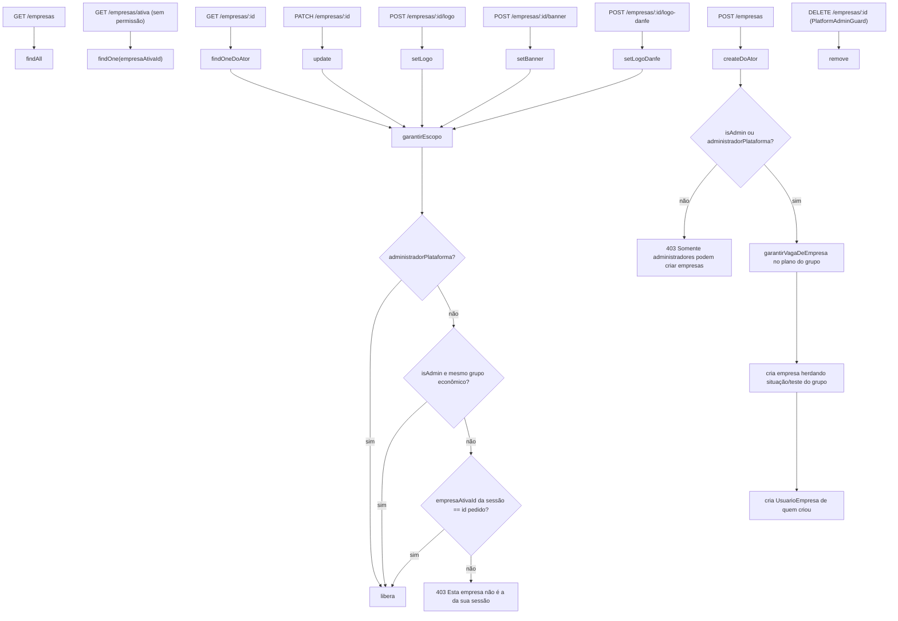

# Fluxograma — Módulo `empresas`

```mermaid
flowchart TD
    A["GET /empresas"] --> S1[findAll]
    B["GET /empresas/ativa (sem permissão)"] --> S2["findOne(empresaAtivaId)"]
    C["GET /empresas/:id"] --> S3[findOneDoAtor]
    D["POST /empresas"] --> S4[createDoAtor]
    E["PATCH /empresas/:id"] --> S5[update]
    F["POST /empresas/:id/logo"] --> S6[setLogo]
    G["POST /empresas/:id/banner"] --> S7[setBanner]
    H["POST /empresas/:id/logo-danfe"] --> S8[setLogoDanfe]
    I["DELETE /empresas/:id (PlatformAdminGuard)"] --> S9[remove]

    S3 --> F1[garantirEscopo]
    S5 --> F1
    S6 --> F1
    S7 --> F1
    S8 --> F1
    F1 --> F2{administradorPlataforma?}
    F2 -- sim --> OK[libera]
    F2 -- não --> F3{isAdmin e mesmo grupo econômico?}
    F3 -- sim --> OK
    F3 -- não --> F4{empresaAtivaId da sessão == id pedido?}
    F4 -- sim --> OK
    F4 -- não --> X[403 Esta empresa não é a da sua sessão]

    S4 --> F5{isAdmin ou administradorPlataforma?}
    F5 -- não --> X2[403 Somente administradores podem criar empresas]
    F5 -- sim --> F6[garantirVagaDeEmpresa no plano do grupo]
    F6 --> F7[cria empresa herdando situação/teste do grupo]
    F7 --> F8[cria UsuarioEmpresa de quem criou]
```
