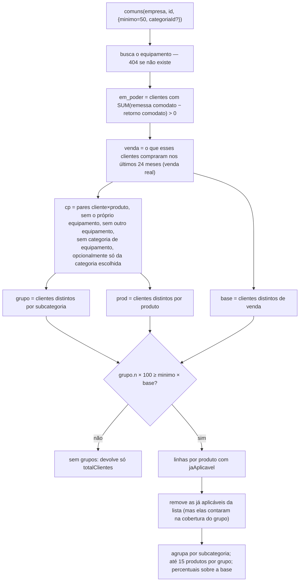

# Fluxograma — `EquipamentosComodatoService.comuns`

```mermaid
flowchart TD
    A["comuns(empresa, id, {minimo=50, categoriaId?})"] --> B[busca o equipamento — 404 se não existe]
    B --> C["em_poder = clientes com SUM(remessa comodato − retorno comodato) > 0"]
    C --> D["venda = o que esses clientes compraram nos últimos 24 meses (venda real)"]
    D --> E["base = clientes distintos de venda"]
    D --> F["cp = pares cliente×produto, sem o próprio equipamento, sem outro equipamento,<br/>sem categoria de equipamento, opcionalmente só da categoria escolhida"]
    F --> G["grupo = clientes distintos por subcategoria"]
    F --> H["prod = clientes distintos por produto"]
    G & H & E --> I{"grupo.n × 100 ≥ minimo × base?"}
    I -- não --> J["sem grupos: devolve só totalClientes"]
    I -- sim --> K["linhas por produto com jaAplicavel"]
    K --> L["remove as já aplicáveis da lista (mas elas contaram na cobertura do grupo)"]
    L --> M["agrupa por subcategoria; até 15 produtos por grupo; percentuais sobre a base"]
```
