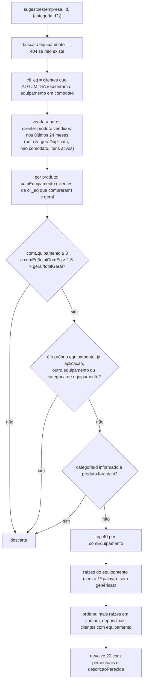

# Fluxograma — `EquipamentosComodatoService.sugestoes`

```mermaid
flowchart TD
    A["sugestoes(empresa, id, {categoriaId?})"] --> B[busca o equipamento — 404 se não existe]
    B --> C["cli_eq = clientes que ALGUM DIA receberam o equipamento em comodato"]
    C --> D["venda = pares cliente×produto vendidos nos últimos 24 meses<br/>(nota N, geraDuplicata, não comodato, itens ativos)"]
    D --> E["por produto: comEquipamento (clientes de cli_eq que compraram) e geral"]
    E --> F{"comEquipamento ≥ 3<br/>e comEq/totalComEq > 1,5 × geral/totalGeral?"}
    F -- não --> FORA[descarta]
    F -- sim --> G{"é o próprio equipamento, já aplicação,<br/>outro equipamento ou categoria de equipamento?"}
    G -- sim --> FORA
    G -- não --> H{"categoriaId informado e produto fora dela?"}
    H -- sim --> FORA
    H -- não --> I["top 40 por comEquipamento"]
    I --> J["raízes do equipamento (sem a 1ª palavra, sem genéricas)"]
    J --> K["ordena: mais raízes em comum, depois mais clientes com equipamento"]
    K --> L["devolve 20 com percentuais e descricaoParecida"]
```
