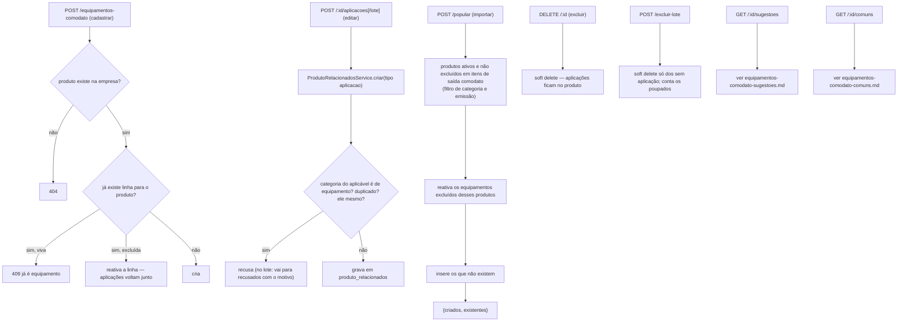

# Fluxograma — Módulo `equipamentos-comodato`

```mermaid
flowchart TD
    C["POST /equipamentos-comodato (cadastrar)"] --> C1{produto existe na empresa?}
    C1 -- não --> X404[404]
    C1 -- sim --> C2{já existe linha para o produto?}
    C2 -- "sim, viva" --> X409[409 já é equipamento]
    C2 -- "sim, excluída" --> C3["reativa a linha — aplicações voltam junto"]
    C2 -- não --> C4[cria]

    A["POST /:id/aplicacoes[/lote] (editar)"] --> A1["ProdutoRelacionadosService.criar(tipo aplicacao)"]
    A1 --> A2{"categoria do aplicável é de equipamento? duplicado? ele mesmo?"}
    A2 -- sim --> A3["recusa (no lote: vai para recusados com o motivo)"]
    A2 -- não --> A4[grava em produto_relacionados]

    P["POST /popular (importar)"] --> P1["produtos ativos e não excluídos em itens de saída comodato<br/>(filtro de categoria e emissão)"]
    P1 --> P2[reativa os equipamentos excluídos desses produtos]
    P2 --> P3[insere os que não existem]
    P3 --> P4["{criados, existentes}"]

    D["DELETE /:id (excluir)"] --> D1["soft delete — aplicações ficam no produto"]
    DL["POST /excluir-lote"] --> DL1["soft delete só dos sem aplicação; conta os poupados"]

    S["GET /:id/sugestoes"] --> S1[ver equipamentos-comodato-sugestoes.md]
    M["GET /:id/comuns"] --> M1[ver equipamentos-comodato-comuns.md]
```
