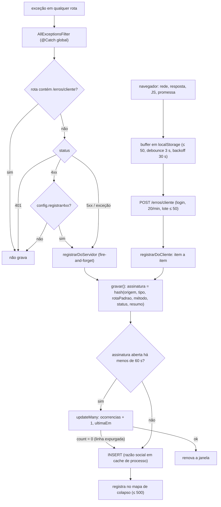
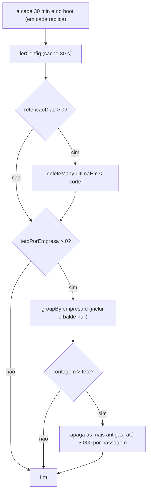
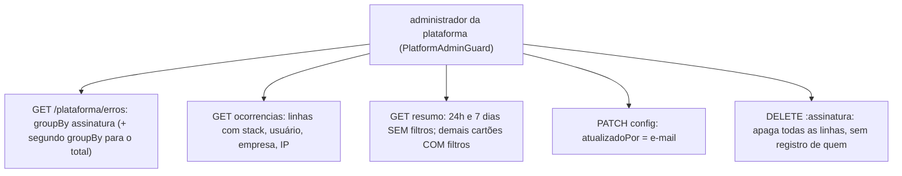

# Fluxograma — Módulo `erros`

```mermaid
flowchart TD
    EX["exceção em qualquer rota"] --> F["AllExceptionsFilter (@Catch global)"]
    F --> R{"rota contém /erros/cliente?"}
    R -- sim --> N[não grava]
    R -- não --> S{"status"}
    S -- "401" --> N
    S -- "4xx" --> C{"config.registrar4xx?"}
    C -- não --> N
    C -- sim --> G
    S -- "5xx / exceção" --> G["registrarDoServidor (fire-and-forget)"]
    G --> GR["gravar(): assinatura = hash(origem, tipo, rotaPadrao, método, status, resumo)"]

    BR["navegador: rede, resposta, JS, promessa"] --> BUF["buffer em localStorage (≤ 50, debounce 3 s, backoff 30 s)"]
    BUF --> P["POST /erros/cliente (login, 20/min, lote ≤ 50)"]
    P --> RC["registrarDoCliente: item a item"]
    RC --> GR

    GR --> K{"assinatura aberta há menos de 60 s?"}
    K -- sim --> U["updateMany: ocorrencias + 1, ultimaEm"]
    U -- "count = 0 (linha expurgada)" --> I
    U -- ok --> RN["renova a janela"]
    K -- não --> I["INSERT (razão social em cache de processo)"]
    I --> RN2["registra no mapa de colapso (≤ 500)"]
```

```mermaid
flowchart TD
    T["a cada 30 min e no boot (em cada réplica)"] --> L["lerConfig (cache 30 s)"]
    L --> A{"retencaoDias > 0?"}
    A -- sim --> D["deleteMany ultimaEm < corte"]
    A -- não --> B
    D --> B{"tetoPorEmpresa > 0?"}
    B -- não --> FIM[fim]
    B -- sim --> GB["groupBy empresaId (inclui o balde null)"]
    GB --> X{"contagem > teto?"}
    X -- sim --> DEL["apaga as mais antigas, até 5.000 por passagem"]
    X -- não --> FIM
    DEL --> FIM
```

```mermaid
flowchart TD
    ADM["administrador da plataforma (PlatformAdminGuard)"] --> LG["GET /plataforma/erros: groupBy assinatura (+ segundo groupBy para o total)"]
    ADM --> OC["GET ocorrencias: linhas com stack, usuário, empresa, IP"]
    ADM --> RS["GET resumo: 24h e 7 dias SEM filtros; demais cartões COM filtros"]
    ADM --> CF["PATCH config: atualizadoPor = e-mail"]
    ADM --> RM["DELETE :assinatura: apaga todas as linhas, sem registro de quem"]
```
