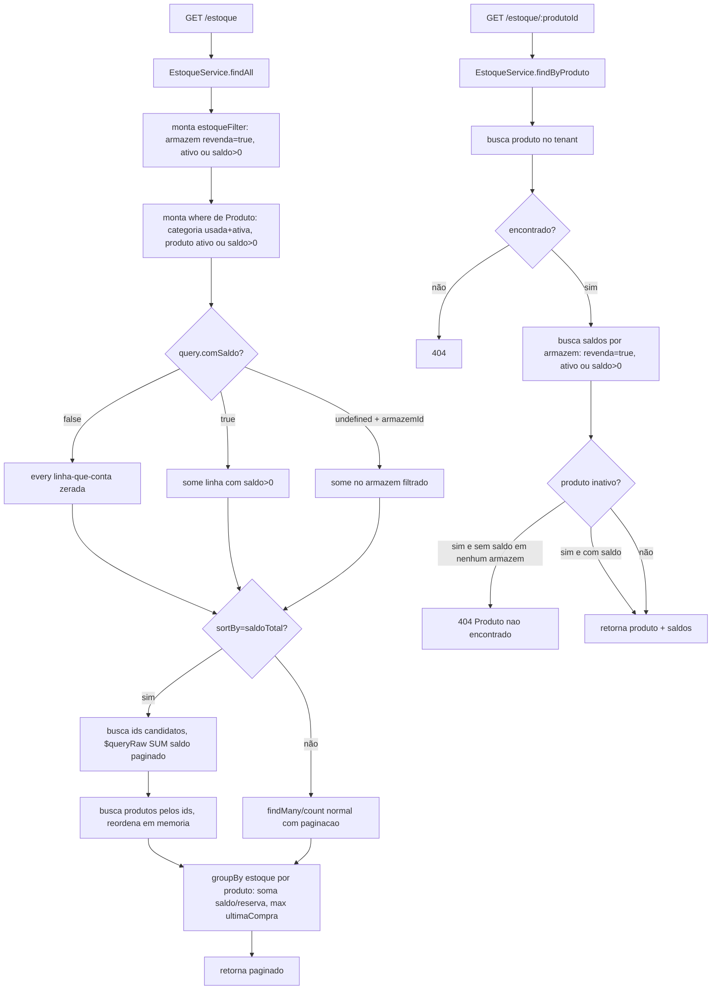

# Fluxograma — Módulo `estoque`

```mermaid
flowchart TD
    A["GET /estoque"] --> S1[EstoqueService.findAll]
    B["GET /estoque/:produtoId"] --> S2[EstoqueService.findByProduto]

    S1 --> F1[monta estoqueFilter: armazem revenda=true, ativo ou saldo>0]
    F1 --> F2[monta where de Produto: categoria usada+ativa, produto ativo ou saldo>0]
    F2 --> F3{query.comSaldo?}
    F3 -- false --> F4[every linha-que-conta zerada]
    F3 -- true --> F5[some linha com saldo>0]
    F3 -- undefined + armazemId --> F6[some no armazem filtrado]
    F4 --> F7{sortBy=saldoTotal?}
    F5 --> F7
    F6 --> F7
    F7 -- sim --> F8[busca ids candidatos, $queryRaw SUM saldo paginado]
    F8 --> F9[busca produtos pelos ids, reordena em memoria]
    F7 -- não --> F10[findMany/count normal com paginacao]
    F9 --> F11[groupBy estoque por produto: soma saldo/reserva, max ultimaCompra]
    F10 --> F11
    F11 --> R1[retorna paginado]

    S2 --> F12[busca produto no tenant]
    F12 --> F13{encontrado?}
    F13 -- não --> X1[404]
    F13 -- sim --> F14[busca saldos por armazem: revenda=true, ativo ou saldo>0]
    F14 --> F15{produto inativo?}
    F15 -- "sim e sem saldo em nenhum armazem" --> X2[404 Produto nao encontrado]
    F15 -- "sim e com saldo" --> R2[retorna produto + saldos]
    F15 -- não --> R2
```
