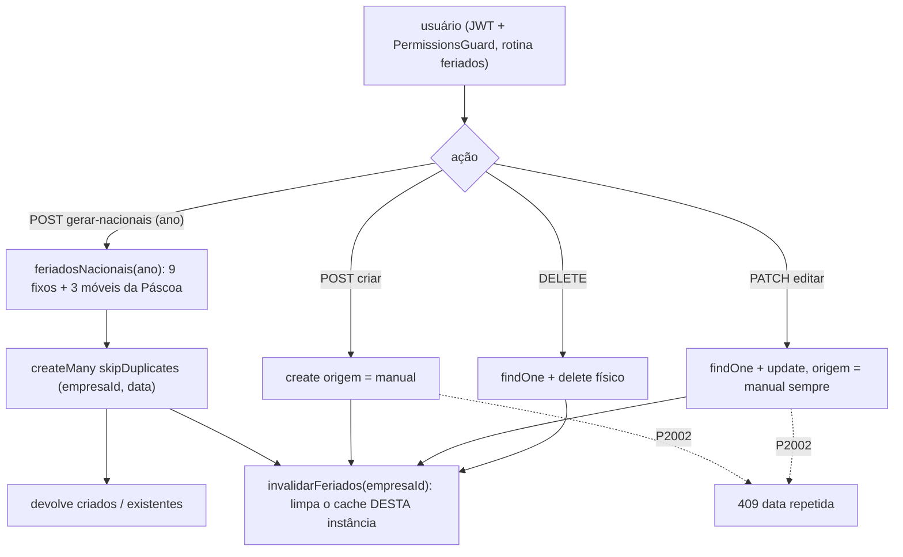
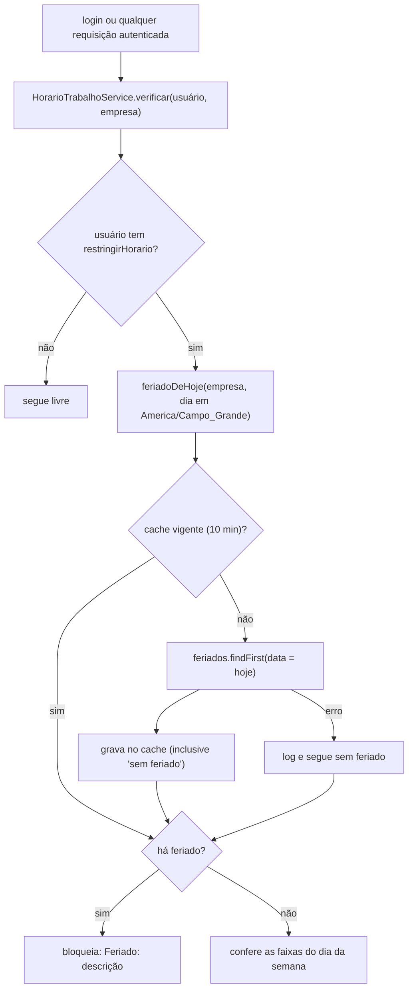
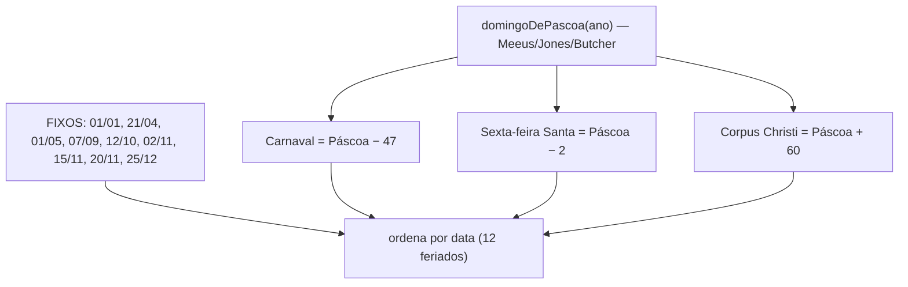

# Fluxograma — Módulo `feriados`

```mermaid
flowchart TD
    U["usuário (JWT + PermissionsGuard, rotina feriados)"] --> A{"ação"}
    A -->|"POST gerar-nacionais (ano)"| G["feriadosNacionais(ano): 9 fixos + 3 móveis da Páscoa"]
    G --> G2["createMany skipDuplicates (empresaId, data)"]
    G2 --> R["devolve criados / existentes"]
    A -->|"POST criar"| C["create origem = manual"]
    A -->|"PATCH editar"| E["findOne + update, origem = manual sempre"]
    A -->|"DELETE"| D["findOne + delete físico"]
    C -. "P2002" .-> X409[409 data repetida]
    E -. "P2002" .-> X409
    G2 --> I
    C --> I
    E --> I
    D --> I["invalidarFeriados(empresaId): limpa o cache DESTA instância"]
```

```mermaid
flowchart TD
    REQ["login ou qualquer requisição autenticada"] --> V["HorarioTrabalhoService.verificar(usuário, empresa)"]
    V --> RS{"usuário tem restringirHorario?"}
    RS -- não --> OK[segue livre]
    RS -- sim --> F["feriadoDeHoje(empresa, dia em America/Campo_Grande)"]
    F --> K{"cache vigente (10 min)?"}
    K -- sim --> H
    K -- não --> Q["feriados.findFirst(data = hoje)"]
    Q -- "erro" --> LOG["log e segue sem feriado"]
    Q --> SAVE["grava no cache (inclusive 'sem feriado')"]
    SAVE --> H{"há feriado?"}
    LOG --> H
    H -- sim --> BLOQ["bloqueia: Feriado: descrição"]
    H -- não --> FX["confere as faixas do dia da semana"]
```

```mermaid
flowchart TD
    P["domingoDePascoa(ano) — Meeus/Jones/Butcher"] --> M1["Carnaval = Páscoa − 47"]
    P --> M2["Sexta-feira Santa = Páscoa − 2"]
    P --> M3["Corpus Christi = Páscoa + 60"]
    F["FIXOS: 01/01, 21/04, 01/05, 07/09, 12/10, 02/11, 15/11, 20/11, 25/12"] --> S
    M1 --> S["ordena por data (12 feriados)"]
    M2 --> S
    M3 --> S
```
