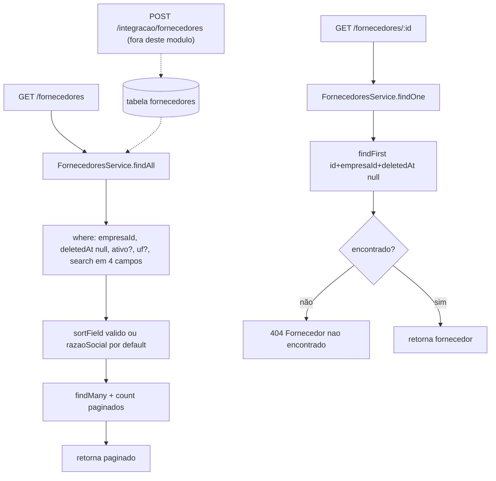

# Fluxograma — Módulo `fornecedores`

```mermaid
flowchart TD
    A["GET /fornecedores"] --> S1[FornecedoresService.findAll]
    B["GET /fornecedores/:id"] --> S2[FornecedoresService.findOne]

    S1 --> F1[where: empresaId, deletedAt null, ativo?, uf?, search em 4 campos]
    F1 --> F2[sortField valido ou razaoSocial por default]
    F2 --> F3[findMany + count paginados]
    F3 --> R1[retorna paginado]

    S2 --> F4[findFirst id+empresaId+deletedAt null]
    F4 --> F5{encontrado?}
    F5 -- não --> X1[404 Fornecedor nao encontrado]
    F5 -- sim --> R2[retorna fornecedor]

    I["POST /integracao/fornecedores (fora deste modulo)"] -.-> T1[(tabela fornecedores)]
    T1 -.-> S1
```
