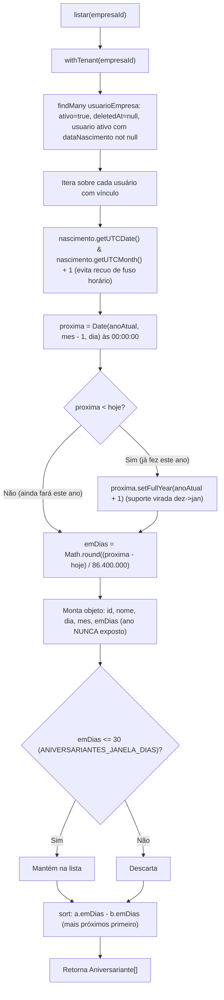

# Fluxograma — Função `AniversariantesService.listar`

```mermaid
flowchart TD
    START["listar(empresaId)"] --> WT["withTenant(empresaId)"]
    WT --> Q["findMany usuarioEmpresa: ativo=true, deletedAt=null, usuario ativo com dataNascimento not null"]
    Q --> LOOP["Itera sobre cada usuário com vínculo"]
    
    LOOP --> UTC["nascimento.getUTCDate() & nascimento.getUTCMonth() + 1 (evita recuo de fuso horário)"]
    UTC --> PROX["proxima = Date(anoAtual, mes - 1, dia) às 00:00:00"]
    PROX --> CMP{"proxima < hoje?"}
    CMP -- "Sim (já fez este ano)" --> NEXT_YEAR["proxima.setFullYear(anoAtual + 1) (suporte virada dez->jan)"]
    CMP -- "Não (ainda fará este ano)" --> CALC_DIFF["emDias = Math.round((proxima - hoje) / 86.400.000)"]
    NEXT_YEAR --> CALC_DIFF
    
    CALC_DIFF --> OBJ["Monta objeto: id, nome, dia, mes, emDias (ano NUNCA exposto)"]
    OBJ --> FLT{"emDias <= 30 (ANIVERSARIANTES_JANELA_DIAS)?"}
    FLT -- "Não" --> DISC["Descarta"]
    FLT -- "Sim" --> KEEP["Mantém na lista"]
    
    KEEP --> SORT["sort: a.emDias - b.emDias (mais próximos primeiro)"]
    DISC --> SORT
    SORT --> RET["Retorna Aniversariante[]"]
```

