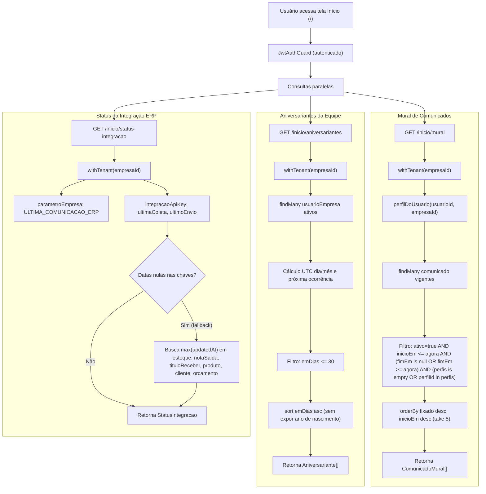
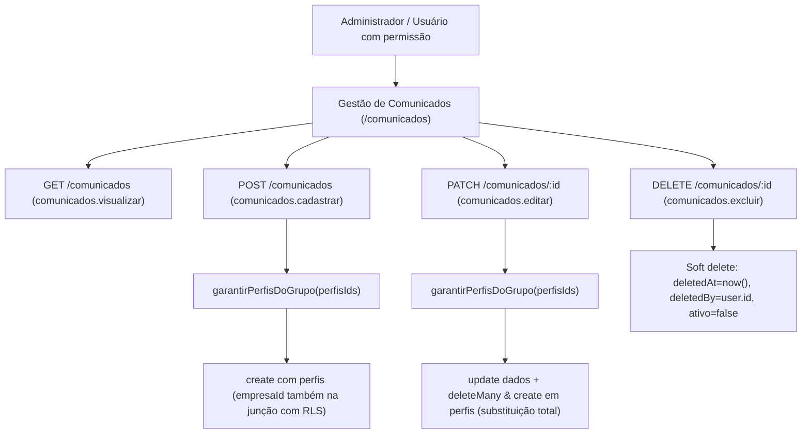

# Fluxograma — Módulo `inicio`

```mermaid
flowchart TD
    USR["Usuário acessa tela Início (/)"] --> AUTH["JwtAuthGuard (autenticado)"]
    AUTH --> PAR["Consultas paralelas"]
    
    PAR --> MURAL["GET /inicio/mural"]
    PAR --> ANIV["GET /inicio/aniversariantes"]
    PAR --> STAT["GET /inicio/status-integracao"]

    subgraph Mural ["Mural de Comunicados"]
        MURAL --> TM["withTenant(empresaId)"]
        TM --> PU["perfilDoUsuario(usuarioId, empresaId)"]
        PU --> FM["findMany comunicado vigentes"]
        FM --> FLT["Filtro: ativo=true AND inicioEm <= agora AND (fimEm is null OR fimEm >= agora) AND (perfis is empty OR perfilId in perfis)"]
        FLT --> ORD["orderBy fixado desc, inicioEm desc (take 5)"]
        ORD --> RESM["Retorna ComunicadoMural[]"]
    end

    subgraph Aniversariantes ["Aniversariantes da Equipe"]
        ANIV --> TA["withTenant(empresaId)"]
        TA --> FA["findMany usuarioEmpresa ativos"]
        FA --> CALC["Cálculo UTC dia/mês e próxima ocorrência"]
        CALC --> J30["Filtro: emDias <= 30"]
        J30 --> SOTA["sort emDias asc (sem expor ano de nascimento)"]
        SOTA --> RESA["Retorna Aniversariante[]"]
    end

    subgraph StatusERP ["Status da Integração ERP"]
        STAT --> TS["withTenant(empresaId)"]
        TS --> COM["parametroEmpresa: ULTIMA_COMUNICACAO_ERP"]
        TS --> KEYS["integracaoApiKey: ultimaColeta, ultimoEnvio"]
        KEYS --> FB{"Datas nulas nas chaves?"}
        FB -- "Sim (fallback)" --> HIST["Busca max(updatedAt) em estoque, notaSaida, tituloReceber, produto, cliente, orcamento"]
        FB -- "Não" --> RESS["Retorna StatusIntegracao"]
        HIST --> RESS
    end
```

```mermaid
flowchart TD
    ADM["Administrador / Usuário com permissão"] --> CRUD["Gestão de Comunicados (/comunicados)"]
    CRUD --> V["GET /comunicados (comunicados.visualizar)"]
    CRUD --> C["POST /comunicados (comunicados.cadastrar)"]
    CRUD --> U["PATCH /comunicados/:id (comunicados.editar)"]
    CRUD --> D["DELETE /comunicados/:id (comunicados.excluir)"]

    C --> GP["garantirPerfisDoGrupo(perfisIds)"]
    GP --> CR["create com perfis (empresaId também na junção com RLS)"]
    
    U --> GPU["garantirPerfisDoGrupo(perfisIds)"]
    GPU --> UP["update dados + deleteMany & create em perfis (substituição total)"]

    D --> SD["Soft delete: deletedAt=now(), deletedBy=user.id, ativo=false"]
```

