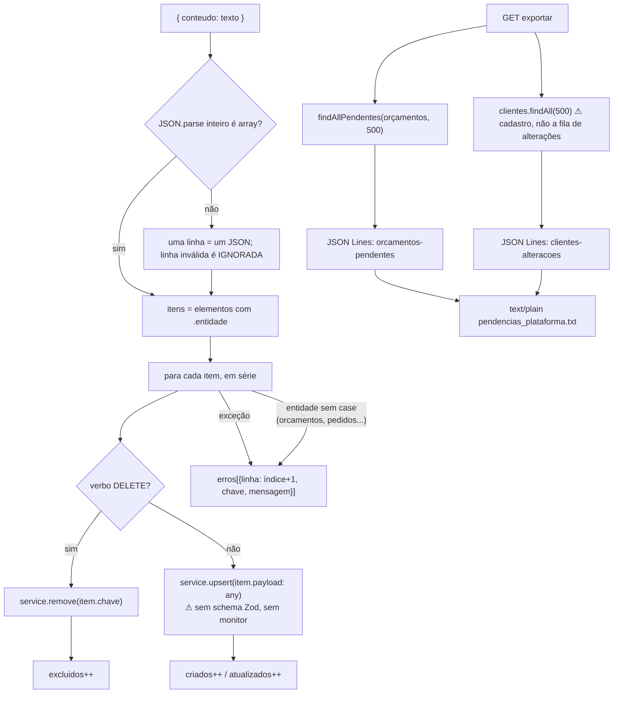

# Fluxograma — `POST /integracao/arquivo/importar` e `GET .../exportar`

```mermaid
flowchart TD
    A["{ conteudo: texto }"] --> B{"JSON.parse inteiro é array?"}
    B -- sim --> C["itens = elementos com .entidade"]
    B -- não --> D["uma linha = um JSON; linha inválida é IGNORADA"]
    D --> C
    C --> E["para cada item, em série"]
    E --> F{"verbo DELETE?"}
    F -- sim --> G["service.remove(item.chave)"]
    F -- não --> H["service.upsert(item.payload: any)<br/>⚠ sem schema Zod, sem monitor"]
    G --> I["excluidos++"]
    H --> J["criados++ / atualizados++"]
    E -- "exceção" --> K["erros[{linha: índice+1, chave, mensagem}]"]
    E -- "entidade sem case<br/>(orcamentos, pedidos...)" --> K

    X["GET exportar"] --> X1["findAllPendentes(orçamentos, 500)"]
    X --> X2["clientes.findAll(500) ⚠ cadastro, não a fila de alterações"]
    X1 --> X3["JSON Lines: orcamentos-pendentes"]
    X2 --> X4["JSON Lines: clientes-alteracoes"]
    X3 --> X5["text/plain pendencias_plataforma.txt"]
    X4 --> X5
```
