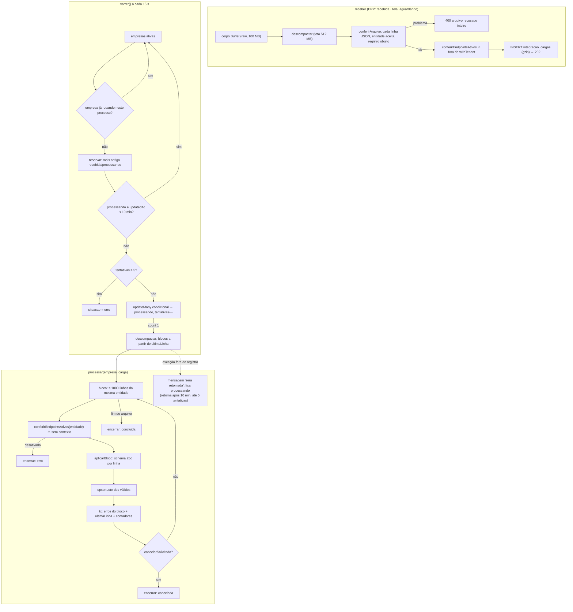

# Fluxograma — carga por arquivo (`receber` e `CargasProcessador`)

```mermaid
flowchart TD
    subgraph Receber["receber (ERP: recebida · tela: aguardando)"]
      R1["corpo Buffer (raw, 100 MB)"] --> R2["descompactar (teto 512 MB)"]
      R2 --> R3["conferirArquivo: cada linha JSON, entidade aceita, registro objeto"]
      R3 -- "problema" --> R4[400 arquivo recusado inteiro]
      R3 -- ok --> R5["conferirEndpointsAtivos ⚠ fora de withTenant"]
      R5 --> R6["INSERT integracao_cargas (gzip) → 202"]
    end

    subgraph Varredura["varrer() a cada 15 s"]
      V1["empresas ativas"] --> V2{"empresa já rodando neste processo?"}
      V2 -- sim --> V1
      V2 -- não --> V3["reservar: mais antiga recebida/processando"]
      V3 --> V4{"processando e updatedAt &lt; 10 min?"}
      V4 -- sim --> V1
      V4 -- não --> V5{"tentativas ≥ 5?"}
      V5 -- sim --> V6[situacao = erro]
      V5 -- não --> V7["updateMany condicional → processando, tentativas++"]
      V7 -- "count 1" --> P0
    end

    subgraph Processar["processar(empresa, carga)"]
      P0["descompactar; blocos a partir de ultimaLinha"] --> P1["bloco: ≤ 1000 linhas da mesma entidade"]
      P1 --> P2["conferirEndpointsAtivos(entidade) ⚠ sem contexto"]
      P2 -- "desativado" --> P3[encerrar: erro]
      P2 --> P4["aplicarBloco: schema Zod por linha"]
      P4 --> P5["upsertLote dos válidos"]
      P5 --> P6["tx: erros do bloco + ultimaLinha + contadores"]
      P6 --> P7{"cancelarSolicitado?"}
      P7 -- sim --> P8[encerrar: cancelada]
      P7 -- não --> P1
      P1 -- "fim do arquivo" --> P9[encerrar: concluida]
      P0 -. "exceção fora do registro" .-> PX["mensagem 'será retomada'; fica processando<br/>(retoma após 10 min, até 5 tentativas)"]
    end
```
