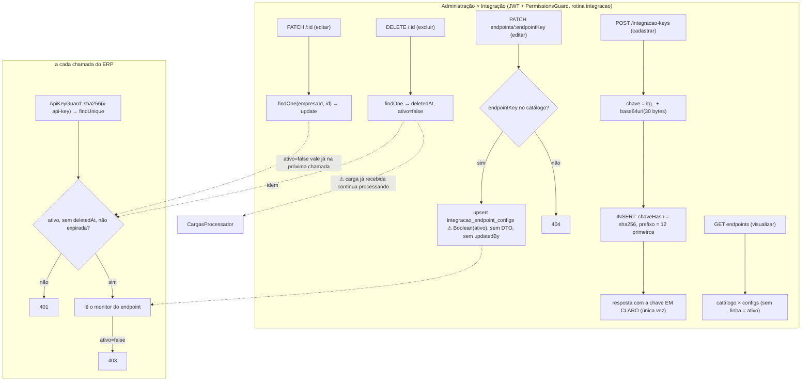

# Fluxograma — Módulo `integracao-keys`

```mermaid
flowchart TD
    subgraph Tela["Administração > Integração (JWT + PermissionsGuard, rotina integracao)"]
      C1["POST /integracao-keys (cadastrar)"] --> C2["chave = itg_ + base64url(30 bytes)"]
      C2 --> C3["INSERT: chaveHash = sha256, prefixo = 12 primeiros"]
      C3 --> C4["resposta com a chave EM CLARO (única vez)"]
      U1["PATCH /:id (editar)"] --> U2["findOne(empresaId, id) → update"]
      D1["DELETE /:id (excluir)"] --> D2["findOne → deletedAt, ativo=false"]
      M1["PATCH endpoints/:endpointKey (editar)"] --> M2{"endpointKey no catálogo?"}
      M2 -- não --> M404[404]
      M2 -- sim --> M3["upsert integracao_endpoint_configs ⚠ Boolean(ativo), sem DTO, sem updatedBy"]
      M0["GET endpoints (visualizar)"] --> M4["catálogo × configs (sem linha = ativo)"]
    end

    subgraph Uso["a cada chamada do ERP"]
      G1["ApiKeyGuard: sha256(x-api-key) → findUnique"] --> G2{"ativo, sem deletedAt, não expirada?"}
      G2 -- não --> G401[401]
      G2 -- sim --> G3["lê o monitor do endpoint"]
      G3 -- "ativo=false" --> G403[403]
    end

    U2 -. "ativo=false vale já na próxima chamada" .-> G2
    D2 -. "idem" .-> G2
    M3 -.-> G3
    D2 -. "⚠ carga já recebida continua processando" .-> CP["CargasProcessador"]
```
