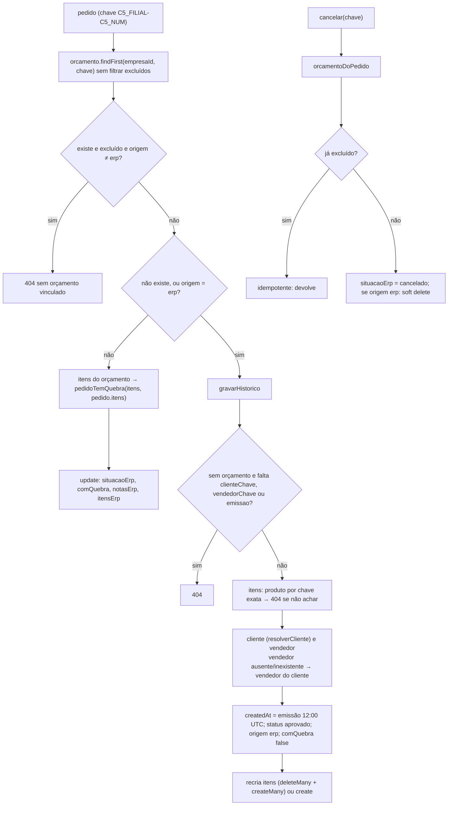

# Fluxograma — `IntegracaoPedidosService.atualizar` / `cancelar`

```mermaid
flowchart TD
    A["pedido (chave C5_FILIAL-C5_NUM)"] --> B["orcamento.findFirst(empresaId, chave) sem filtrar excluídos"]
    B --> C{"existe e excluído e origem ≠ erp?"}
    C -- sim --> X404["404 sem orçamento vinculado"]
    C -- não --> D{"não existe, ou origem = erp?"}
    D -- sim --> H["gravarHistorico"]
    D -- não --> E["itens do orçamento → pedidoTemQuebra(itens, pedido.itens)"]
    E --> F["update: situacaoErp, comQuebra, notasErp, itensErp"]

    H --> H1{"sem orçamento e falta clienteChave, vendedorChave ou emissao?"}
    H1 -- sim --> X404b[404]
    H1 -- não --> H2["itens: produto por chave exata → 404 se não achar"]
    H2 --> H3["cliente (resolverCliente) e vendedor<br/>vendedor ausente/inexistente → vendedor do cliente"]
    H3 --> H4["createdAt = emissão 12:00 UTC; status aprovado; origem erp; comQuebra false"]
    H4 --> H5["recria itens (deleteMany + createMany) ou create"]

    Z["cancelar(chave)"] --> Z1["orcamentoDoPedido"]
    Z1 --> Z2{"já excluído?"}
    Z2 -- sim --> Z3["idempotente: devolve"]
    Z2 -- não --> Z4["situacaoErp = cancelado; se origem erp: soft delete"]
```
