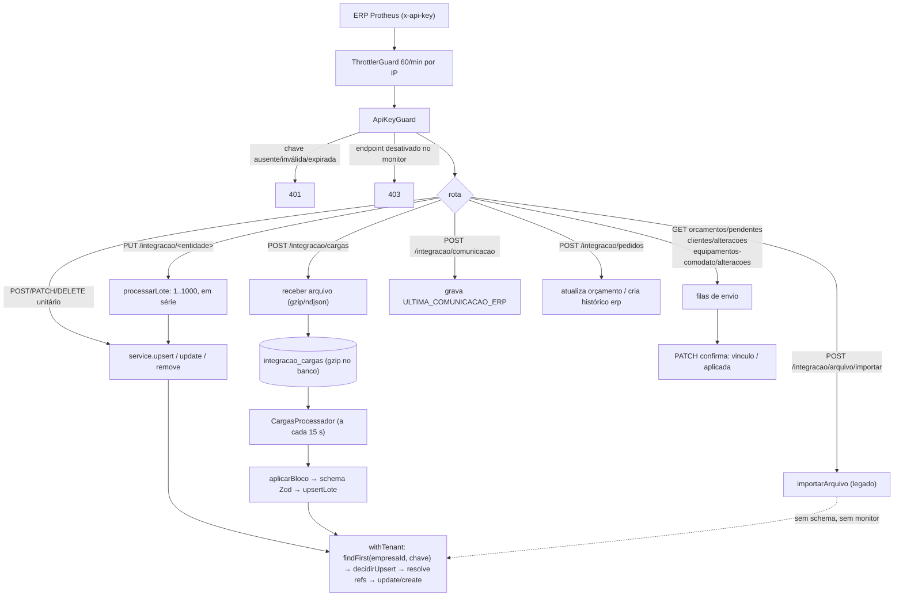

# Fluxograma — Módulo `integracao`

```mermaid
flowchart TD
    ERP["ERP Protheus (x-api-key)"] --> T["ThrottlerGuard 60/min por IP"]
    T --> G["ApiKeyGuard"]
    G -->|"chave ausente/inválida/expirada"| E401[401]
    G -->|"endpoint desativado no monitor"| E403[403]
    G --> R{"rota"}

    R -->|"PUT /integracao/&lt;entidade&gt;"| L["processarLote: 1..1000, em série"]
    R -->|"POST/PATCH/DELETE unitário"| U["service.upsert / update / remove"]
    R -->|"POST /integracao/cargas"| C["receber arquivo (gzip/ndjson)"]
    R -->|"POST /integracao/arquivo/importar"| I["importarArquivo (legado)"]
    R -->|"GET orcamentos/pendentes<br/>clientes/alteracoes<br/>equipamentos-comodato/alteracoes"| F["filas de envio"]
    R -->|"POST /integracao/comunicacao"| B["grava ULTIMA_COMUNICACAO_ERP"]
    R -->|"POST /integracao/pedidos"| P["atualiza orçamento / cria histórico erp"]

    L --> U
    U --> W["withTenant: findFirst(empresaId, chave) → decidirUpsert → resolve refs → update/create"]
    C --> Q[("integracao_cargas (gzip no banco)")]
    Q --> PR["CargasProcessador (a cada 15 s)"]
    PR --> L2["aplicarBloco → schema Zod → upsertLote"]
    L2 --> W
    I -. "sem schema, sem monitor" .-> W
    F --> CF["PATCH confirma: vinculo / aplicada"]
```
