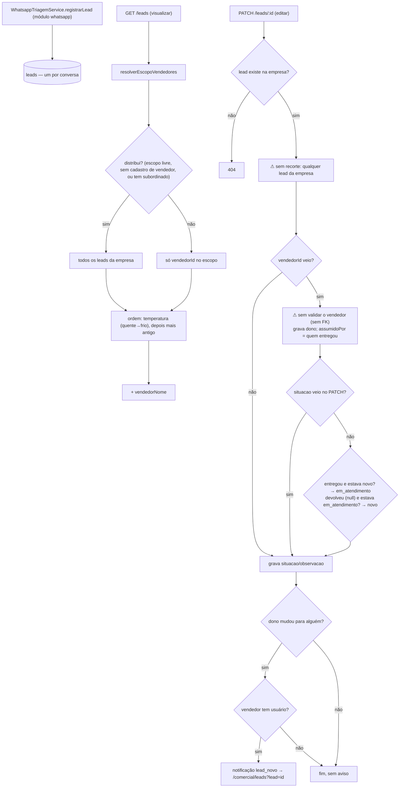

# Fluxograma — Módulo `leads`

```mermaid
flowchart TD
    W["WhatsappTriagemService.registrarLead (módulo whatsapp)"] --> LD[(leads — um por conversa)]

    L["GET /leads (visualizar)"] --> L1[resolverEscopoVendedores]
    L1 --> L2{"distribui? (escopo livre, sem cadastro de vendedor, ou tem subordinado)"}
    L2 -- sim --> L3[todos os leads da empresa]
    L2 -- não --> L4[só vendedorId no escopo]
    L3 & L4 --> L5["ordem: temperatura (quente→frio), depois mais antigo"]
    L5 --> L6[+ vendedorNome]

    A["PATCH /leads/:id (editar)"] --> A1{"lead existe na empresa?"}
    A1 -- não --> N404[404]
    A1 -- sim --> A0["⚠ sem recorte: qualquer lead da empresa"]
    A0 --> A2{vendedorId veio?}
    A2 -- não --> A6[grava situacao/observacao]
    A2 -- sim --> A3["⚠ sem validar o vendedor (sem FK)<br/>grava dono; assumidoPor = quem entregou"]
    A3 --> A4{situacao veio no PATCH?}
    A4 -- sim --> A6
    A4 -- não --> A5{"entregou e estava novo? → em_atendimento<br/>devolveu (null) e estava em_atendimento? → novo"}
    A5 --> A6
    A6 --> A7{dono mudou para alguém?}
    A7 -- sim --> A8{vendedor tem usuário?}
    A8 -- sim --> A9["notificação lead_novo → /comercial/leads?lead=id"]
    A8 -- não --> FIM[fim, sem aviso]
    A7 -- não --> FIM
```
