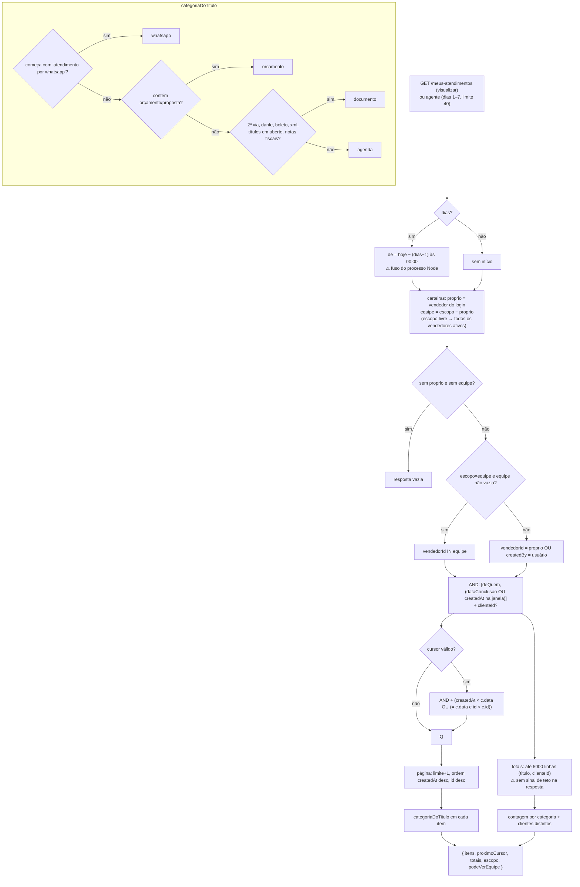

# Fluxograma — Módulo `meus-atendimentos`

```mermaid
flowchart TD
    R["GET /meus-atendimentos (visualizar)<br/>ou agente (dias 1–7, limite 40)"] --> J{dias?}
    J -- sim --> J1["de = hoje − (dias−1) às 00:00<br/>⚠ fuso do processo Node"]
    J -- não --> J2[sem início]
    J1 & J2 --> C["carteiras: proprio = vendedor do login<br/>equipe = escopo − proprio<br/>(escopo livre → todos os vendedores ativos)"]
    C --> V{"sem proprio e sem equipe?"}
    V -- sim --> VZ[resposta vazia]
    V -- não --> E{"escopo=equipe e equipe não vazia?"}
    E -- sim --> EQ["vendedorId IN equipe"]
    E -- não --> PR["vendedorId = proprio OU createdBy = usuário"]
    EQ & PR --> P["AND: [deQuem, (dataConclusao OU createdAt na janela)]<br/>+ clienteId?"]
    P --> CU{cursor válido?}
    CU -- sim --> CU1["AND + (createdAt < c.data OU (= c.data e id < c.id))"]
    CU -- não --> Q
    CU1 --> Q
    Q --> Q1["página: limite+1, ordem createdAt desc, id desc"]
    P --> Q2["totais: até 5000 linhas (titulo, clienteId)<br/>⚠ sem sinal de teto na resposta"]
    Q1 --> K["categoriaDoTitulo em cada item"]
    Q2 --> K2["contagem por categoria + clientes distintos"]
    K --> OUT["{ itens, proximoCursor, totais, escopo, podeVerEquipe }"]
    K2 --> OUT

    subgraph Cat["categoriaDoTitulo"]
      T1{"começa com 'atendimento por whatsapp'?"} -- sim --> W[whatsapp]
      T1 -- não --> T2{"contém orçamento/proposta?"}
      T2 -- sim --> O[orcamento]
      T2 -- não --> T3{"2ª via, danfe, boleto, xml,<br/>títulos em aberto, notas fiscais?"}
      T3 -- sim --> D[documento]
      T3 -- não --> A[agenda]
    end
```
