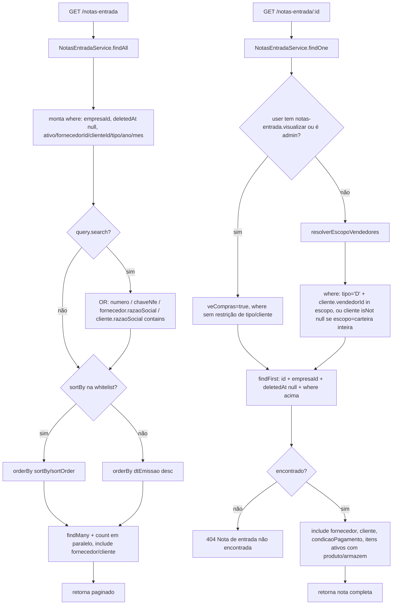

# Fluxograma — Módulo `notas-entrada`

```mermaid
flowchart TD
    A["GET /notas-entrada"] --> S1[NotasEntradaService.findAll]
    B["GET /notas-entrada/:id"] --> S2[NotasEntradaService.findOne]

    S1 --> F1[monta where: empresaId, deletedAt null, ativo/fornecedorId/clienteId/tipo/ano/mes]
    F1 --> F2{query.search?}
    F2 -- sim --> F3[OR: numero / chaveNfe / fornecedor.razaoSocial / cliente.razaoSocial contains]
    F2 -- não --> F4
    F3 --> F4{sortBy na whitelist?}
    F4 -- sim --> F5[orderBy sortBy/sortOrder]
    F4 -- não --> F6[orderBy dtEmissao desc]
    F5 --> F7[findMany + count em paralelo, include fornecedor/cliente]
    F6 --> F7
    F7 --> R1[retorna paginado]

    S2 --> F8{"user tem notas-entrada.visualizar ou é admin?"}
    F8 -- sim --> F9["veCompras=true, where sem restrição de tipo/cliente"]
    F8 -- não --> F10[resolverEscopoVendedores]
    F10 --> F11["where: tipo='D' + cliente.vendedorId in escopo, ou cliente isNot null se escopo=carteira inteira"]
    F9 --> F12[findFirst: id + empresaId + deletedAt null + where acima]
    F11 --> F12
    F12 --> F13{encontrado?}
    F13 -- não --> X1[404 Nota de entrada não encontrada]
    F13 -- sim --> F14[include fornecedor, cliente, condicaoPagamento, itens ativos com produto/armazem]
    F14 --> R2[retorna nota completa]
```
