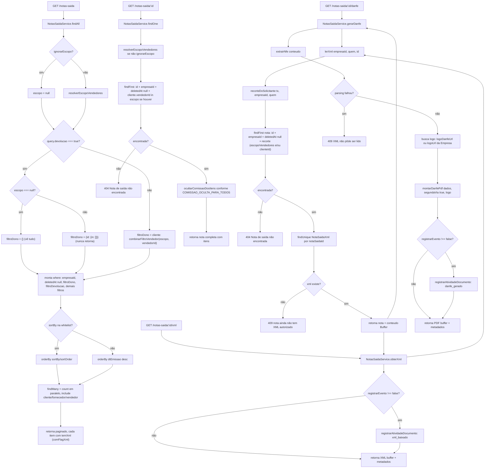

# Fluxograma — Módulo `notas-saida`

```mermaid
flowchart TD
    A["GET /notas-saida"] --> S1[NotasSaidaService.findAll]
    B["GET /notas-saida/:id"] --> S2[NotasSaidaService.findOne]
    C["GET /notas-saida/:id/danfe"] --> S3[NotasSaidaService.gerarDanfe]
    D["GET /notas-saida/:id/xml"] --> S4[NotasSaidaService.obterXml]

    S1 --> F1{ignorarEscopo?}
    F1 -- sim --> F2["escopo = null"]
    F1 -- não --> F3[resolverEscopoVendedores]
    F2 --> F4{query.devolucao === true?}
    F3 --> F4
    F4 -- sim --> F5{escopo === null?}
    F5 -- sim --> F6["filtroDono = {} (vê tudo)"]
    F5 -- não --> F7["filtroDono = {id: {in: []}} (nunca retorna)"]
    F4 -- não --> F8["filtroDono = cliente: combinarFiltroVendedor(escopo, vendedorId)"]
    F6 --> F9[monta where: empresaId, deletedAt null, filtroDono, filtroDevolucao, demais filtros]
    F7 --> F9
    F8 --> F9
    F9 --> F10{sortBy na whitelist?}
    F10 -- sim --> F11[orderBy sortBy/sortOrder]
    F10 -- não --> F12[orderBy dtEmissao desc]
    F11 --> F13[findMany + count em paralelo, include cliente/fornecedor/vendedor]
    F12 --> F13
    F13 --> R1["retorna paginado, cada item com temXml (comFlagXml)"]

    S2 --> G1[resolverEscopoVendedores se não ignorarEscopo]
    G1 --> G2["findFirst: id + empresaId + deletedAt null + cliente.vendedorId in escopo se houver"]
    G2 --> G3{encontrada?}
    G3 -- não --> X1[404 Nota de saída não encontrada]
    G3 -- sim --> G4[ocultarComissaoDosItens conforme COMISSAO_OCULTA_PARA_TODOS]
    G4 --> R2[retorna nota completa com itens]

    S3 --> H1[lerXml empresaId, quem, id]
    S4 --> H1
    H1 --> H2[recorteDoSolicitante tx, empresaId, quem]
    H2 --> H3["findFirst nota: id + empresaId + deletedAt null + recorte (escopoVendedores e/ou clienteId)"]
    H3 --> H4{encontrada?}
    H4 -- não --> X2[404 Nota de saída não encontrada]
    H4 -- sim --> H5["findUnique NotaSaidaXml por notaSaidaId"]
    H5 --> H6{xml existe?}
    H6 -- não --> X3["409 nota ainda não tem XML autorizado"]
    H6 -- sim --> H7[retorna nota + conteudo Buffer]

    H7 --> S3
    S3 --> I1[extrairNfe conteudo] 
    I1 --> I2{parsing falhou?}
    I2 -- sim --> X4["409 XML não pôde ser lido"]
    I2 -- não --> I3[busca logo: logoDanfeUrl ou logoUrl da Empresa]
    I3 --> I4[montarDanfePdf dados, segundaVia true, logo]
    I4 --> I5{registrarEvento !== false?}
    I5 -- sim --> I6["registrarAtividadeDocumento: danfe_gerado"]
    I5 -- não --> R3
    I6 --> R3[retorna PDF buffer + metadados]

    H7 --> S4
    S4 --> J1{registrarEvento !== false?}
    J1 -- sim --> J2["registrarAtividadeDocumento: xml_baixado"]
    J1 -- não --> R4
    J2 --> R4[retorna XML buffer + metadados]
```
