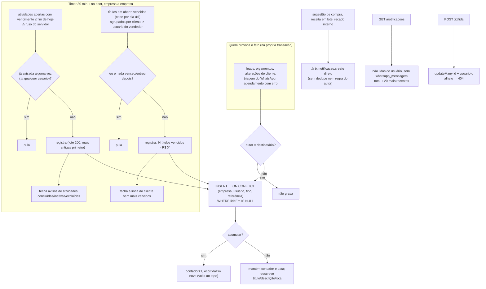

# Fluxograma — Módulo `notificacoes`

```mermaid
flowchart TD
    subgraph Origem["Quem provoca o fato (na própria transação)"]
      O1[leads, orçamentos, alterações de cliente,<br/>triagem do WhatsApp, agendamento com erro]
    end
    O1 --> R{"autor = destinatário?"}
    R -- sim --> X[não grava]
    R -- não --> UP["INSERT … ON CONFLICT (empresa, usuário, tipo, referência)<br/>WHERE lidaEm IS NULL"]
    UP --> AC{"acumular?"}
    AC -- sim --> AC1["contador+1, ocorridaEm novo (volta ao topo)"]
    AC -- não --> AC2["mantém contador e data; reescreve título/descrição/rota"]

    O2["sugestão de compra, receita em lote, recado interno"] --> CR["⚠ tx.notificacao.create direto<br/>(sem dedupe nem regra do autor)"]

    subgraph Varredura["Timer 30 min + no boot, empresa a empresa"]
      V1["atividades abertas com vencimento ≤ fim de hoje<br/>⚠ fuso do servidor"] --> V1a{"já avisada alguma vez<br/>(⚠ qualquer usuário)?"}
      V1a -- sim --> V1x[pula]
      V1a -- não --> V1b["registra (lote 200, mais antigas primeiro)"]
      V1b --> V1c["fecha avisos de atividades concluídas/inativas/excluídas"]

      V2["títulos em aberto vencidos (corte por dia útil)<br/>agrupados por cliente × usuário do vendedor"] --> V2a{"leu e nada venceu/entrou depois?"}
      V2a -- sim --> V2x[pula]
      V2a -- não --> V2b["registra: 'N títulos vencidos · R$ X'"]
      V2b --> V2c["fecha a linha do cliente sem mais vencidos"]
    end
    V1b & V2b --> UP

    S["GET /notificacoes"] --> S1["não lidas do usuário, sem whatsapp_mensagem<br/>total + 20 mais recentes"]
    L["POST :id/lida"] --> L1["updateMany id + usuarioId<br/>alheio → 404"]
```
