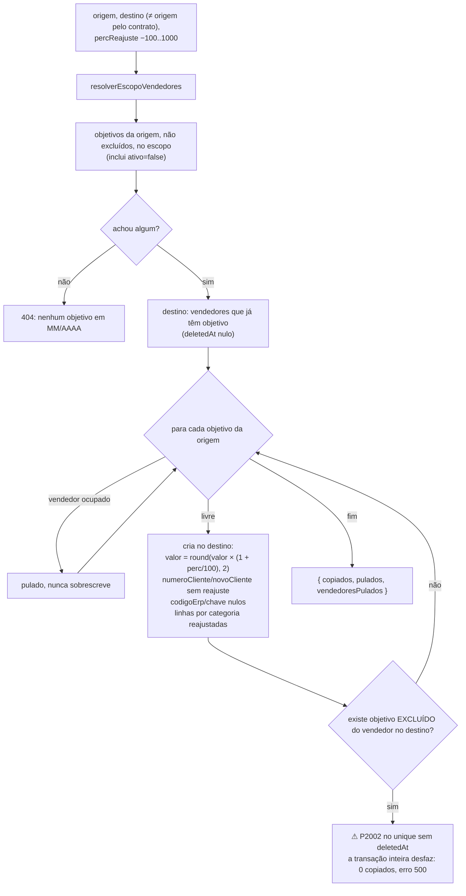

# Fluxograma — `ObjetivosService.copiarPeriodo`

```mermaid
flowchart TD
    I["origem, destino (≠ origem pelo contrato),<br/>percReajuste −100..1000"] --> E[resolverEscopoVendedores]
    E --> O["objetivos da origem, não excluídos, no escopo<br/>(inclui ativo=false)"]
    O --> O1{achou algum?}
    O1 -- não --> N404["404: nenhum objetivo em MM/AAAA"]
    O1 -- sim --> J["destino: vendedores que já têm objetivo<br/>(deletedAt nulo)"]
    J --> L{para cada objetivo da origem}
    L -- vendedor ocupado --> PUL[pulado, nunca sobrescreve]
    L -- livre --> CR["cria no destino:<br/>valor = round(valor × (1 + perc/100), 2)<br/>numeroCliente/novoCliente sem reajuste<br/>codigoErp/chave nulos<br/>linhas por categoria reajustadas"]
    CR --> U{"existe objetivo EXCLUÍDO do vendedor no destino?"}
    U -- sim --> ERR["⚠ P2002 no unique sem deletedAt<br/>a transação inteira desfaz: 0 copiados, erro 500"]
    U -- não --> L
    PUL --> L
    L -- fim --> R["{ copiados, pulados, vendedoresPulados }"]
```
