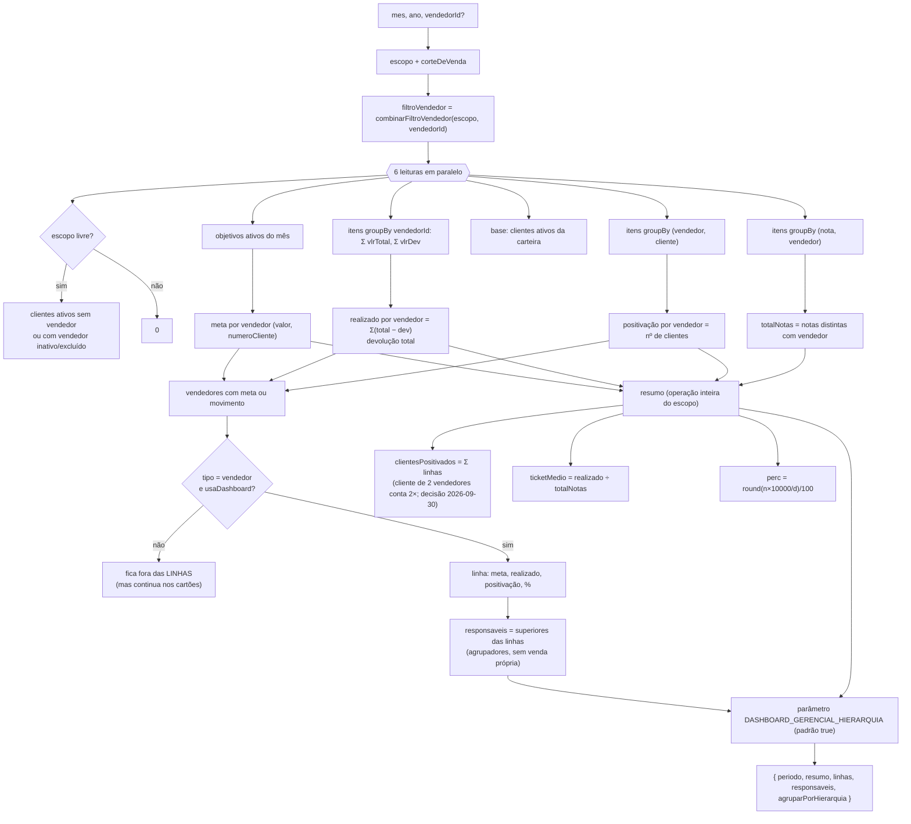

# Fluxograma — `ObjetivosService.dashboardGerencial`

```mermaid
flowchart TD
    I["mes, ano, vendedorId?"] --> E[escopo + corteDeVenda]
    E --> F["filtroVendedor = combinarFiltroVendedor(escopo, vendedorId)"]
    F --> P{{"6 leituras em paralelo"}}
    P --> P1["objetivos ativos do mês"]
    P --> P2["itens groupBy vendedorId: Σ vlrTotal, Σ vlrDev"]
    P --> P3["itens groupBy (vendedor, cliente)"]
    P --> P4["base: clientes ativos da carteira"]
    P --> P5{"escopo livre?"}
    P5 -- sim --> P5a["clientes ativos sem vendedor<br/>ou com vendedor inativo/excluído"]
    P5 -- não --> P5b[0]
    P --> P6["itens groupBy (nota, vendedor)"]

    P1 --> M1["meta por vendedor (valor, numeroCliente)"]
    P2 --> M2["realizado por vendedor = Σ(total − dev)<br/>devolução total"]
    P3 --> M3["positivação por vendedor = nº de clientes"]
    P6 --> M4["totalNotas = notas distintas com vendedor"]

    M1 & M2 & M3 --> V["vendedores com meta ou movimento"]
    V --> V1{"tipo = vendedor<br/>e usaDashboard?"}
    V1 -- não --> V2["fica fora das LINHAS<br/>(mas continua nos cartões)"]
    V1 -- sim --> V3["linha: meta, realizado, positivação, %"]
    V3 --> R["responsaveis = superiores das linhas<br/>(agrupadores, sem venda própria)"]

    M1 & M2 & M3 & M4 --> S["resumo (operação inteira do escopo)"]
    S --> S1["clientesPositivados = Σ linhas<br/>(cliente de 2 vendedores conta 2×; decisão 2026-09-30)"]
    S --> S2["ticketMedio = realizado ÷ totalNotas"]
    S --> S3["perc = round(n×10000/d)/100"]
    R & S --> PR["parâmetro DASHBOARD_GERENCIAL_HIERARQUIA (padrão true)"]
    PR --> OUT["{ periodo, resumo, linhas, responsaveis, agruparPorHierarquia }"]
```
