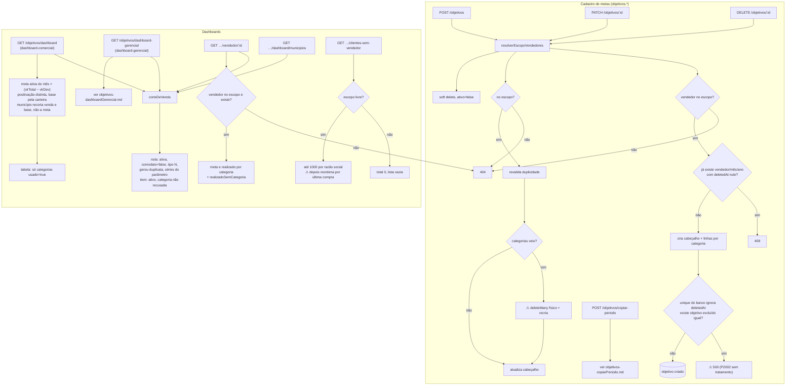

# Fluxograma — Módulo `objetivos`

```mermaid
flowchart TD
    E["resolverEscopoVendedores"]

    subgraph Cadastro["Cadastro de metas (objetivos.*)"]
      C["POST /objetivos"] --> E
      E --> C1{vendedor no escopo?}
      C1 -- não --> N404[404]
      C1 -- sim --> C2{"já existe vendedor/mês/ano<br/>com deletedAt nulo?"}
      C2 -- sim --> N409[409]
      C2 -- não --> C3["cria cabeçalho + linhas por categoria"]
      C3 --> C4{"unique do banco ignora deletedAt<br/>existe objetivo excluído igual?"}
      C4 -- sim --> E500["⚠ 500 (P2002 sem tratamento)"]
      C4 -- não --> OK[(objetivo criado)]

      U["PATCH /objetivos/:id"] --> E
      E --> U1{no escopo?}
      U1 -- não --> N404
      U1 -- sim --> U2[revalida duplicidade]
      U2 --> U3{categorias veio?}
      U3 -- sim --> U4["⚠ deleteMany físico + recria"]
      U3 -- não --> U5[atualiza cabeçalho]
      U4 --> U5

      D["DELETE /objetivos/:id"] --> E
      E --> D1[soft delete, ativo=false]

      CP["POST /objetivos/copiar-periodo"] --> CPF["ver objetivos-copiarPeriodo.md"]
    end

    subgraph Dash["Dashboards"]
      DC["GET /objetivos/dashboard<br/>(dashboard-comercial)"] --> CV[corteDeVenda]
      DG["GET /objetivos/dashboard-gerencial<br/>(dashboard-gerencial)"] --> CV
      DV["GET …/vendedor/:id"] --> CV
      DM["GET …/dashboard/municipios"] --> CV
      CV --> CVd["nota: ativa, comodato=false, tipo N,<br/>gerou duplicata, séries do parâmetro<br/>item: ativo, categoria não recusada"]
      DG --> DGF["ver objetivos-dashboardGerencial.md"]
      DC --> DC1["meta ativa do mês × (vlrTotal − vlrDev)<br/>positivação distinta, base pela carteira<br/>município recorta venda e base, não a meta"]
      DC1 --> DC2["tabela: só categorias usado=true"]
      DV --> DV1{vendedor no escopo e existe?}
      DV1 -- não --> N404
      DV1 -- sim --> DV2["meta e realizado por categoria<br/>+ realizadoSemCategoria"]
      CS["GET …/clientes-sem-vendedor"] --> CS1{escopo livre?}
      CS1 -- não --> CS0["total 0, lista vazia"]
      CS1 -- sim --> CS2["até 1000 por razão social<br/>⚠ depois reordena por última compra"]
    end
```
