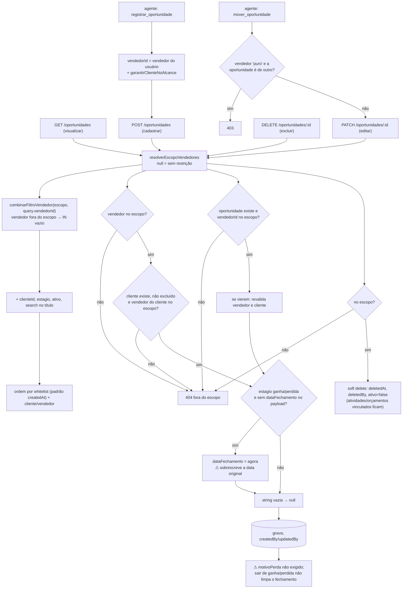

# Fluxograma — Módulo `oportunidades`

```mermaid
flowchart TD
    E["resolverEscopoVendedores<br/>null = sem restrição"]

    L["GET /oportunidades (visualizar)"] --> E
    E --> L1["combinarFiltroVendedor(escopo, query.vendedorId)<br/>vendedor fora do escopo → IN vazio"]
    L1 --> L2["+ clienteId, estagio, ativo, search no título"]
    L2 --> L3["ordem por whitelist (padrão createdAt) + cliente/vendedor"]

    C["POST /oportunidades (cadastrar)"] --> E
    E --> C1{vendedor no escopo?}
    C1 -- não --> N404[404 fora do escopo]
    C1 -- sim --> C2{"cliente existe, não excluído<br/>e vendedor do cliente no escopo?"}
    C2 -- não --> N404
    C2 -- sim --> NF

    U["PATCH /oportunidades/:id (editar)"] --> E
    E --> U1{"oportunidade existe e<br/>vendedorId no escopo?"}
    U1 -- não --> N404
    U1 -- sim --> U2["se vierem: revalida vendedor e cliente"]
    U2 --> NF

    NF{"estagio ganha/perdida<br/>e sem dataFechamento no payload?"}
    NF -- sim --> NF1["dataFechamento = agora<br/>⚠ sobrescreve a data original"]
    NF -- não --> LP
    NF1 --> LP["string vazia → null"]
    LP --> G[(grava; createdBy/updatedBy)]
    G --> W["⚠ motivoPerda não exigido;<br/>sair de ganha/perdida não limpa o fechamento"]

    D["DELETE /oportunidades/:id (excluir)"] --> E
    E --> D1{no escopo?}
    D1 -- não --> N404
    D1 -- sim --> D2["soft delete: deletedAt, deletedBy, ativo=false<br/>(atividades/orçamentos vinculados ficam)"]

    AG["agente: registrar_oportunidade"] --> AG1["vendedorId = vendedor do usuário<br/>+ garantirClienteNoAlcance"] --> C
    AM["agente: mover_oportunidade"] --> AM1{"vendedor 'puro' e a<br/>oportunidade é de outro?"}
    AM1 -- sim --> F403[403]
    AM1 -- não --> U
```
