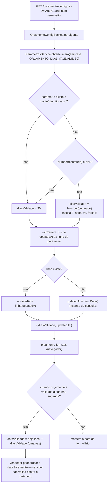

# Fluxograma — Módulo `orcamento-config`

```mermaid
flowchart TD
    A["GET /orcamento-config (só JwtAuthGuard, sem permissão)"] --> S[OrcamentoConfigService.getVigente]
    S --> P["ParametrosService.obterNumero(empresa, ORCAMENTO_DIAS_VALIDADE, 30)"]
    P --> P1{parâmetro existe e conteúdo não vazio?}
    P1 -- não --> D30[diasValidade = 30]
    P1 -- sim --> P2{"Number(conteudo) é NaN?"}
    P2 -- sim --> D30
    P2 -- não --> DV["diasValidade = Number(conteudo)<br/>(aceita 0, negativo, fração)"]
    D30 --> U
    DV --> U["withTenant: busca updatedAt da linha do parâmetro"]
    U --> U1{linha existe?}
    U1 -- sim --> R1["updatedAt = linha.updatedAt"]
    U1 -- não --> R2["updatedAt = new Date() (instante da consulta)"]
    R1 --> R["{ diasValidade, updatedAt }"]
    R2 --> R

    R --> W["orcamento-form.tsx (navegador)"]
    W --> W1{criando orçamento e validade ainda não sugerida?}
    W1 -- sim --> W2["dataValidade = hoje local + diasValidade (uma vez)"]
    W1 -- não --> W3[mantém a data do formulário]
    W2 --> W4[vendedor pode trocar a data livremente — servidor não valida contra o parâmetro]
```
