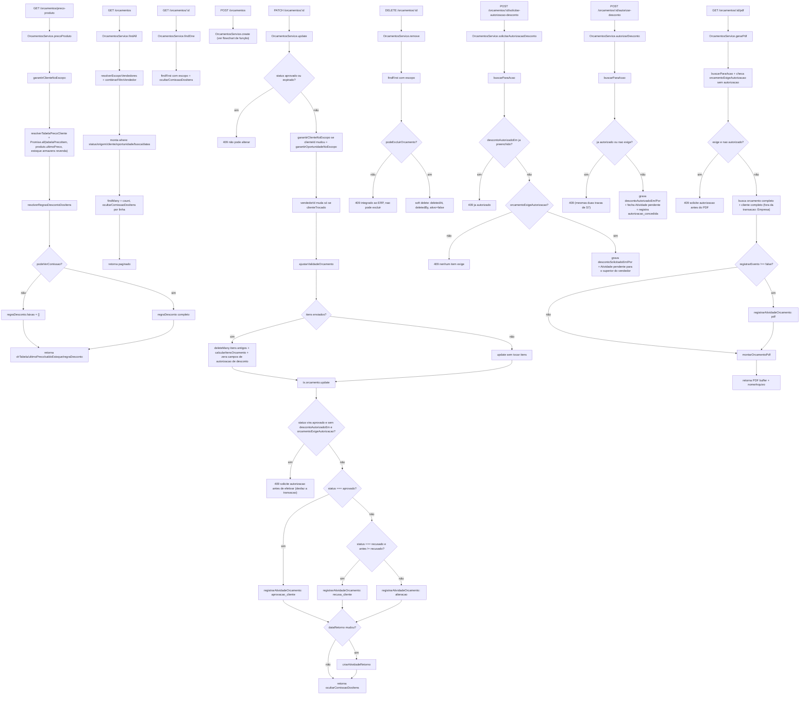

# Fluxograma — Módulo `orcamentos`

```mermaid
flowchart TD
    A["GET /orcamentos/preco-produto"] --> S1[OrcamentosService.precoProduto]
    B["GET /orcamentos"] --> S2[OrcamentosService.findAll]
    C["GET /orcamentos/:id"] --> S3[OrcamentosService.findOne]
    D["POST /orcamentos"] --> S4["OrcamentosService.create (ver flowchart de função)"]
    E["PATCH /orcamentos/:id"] --> S5[OrcamentosService.update]
    F["DELETE /orcamentos/:id"] --> S6[OrcamentosService.remove]
    G["POST /orcamentos/:id/solicitar-autorizacao-desconto"] --> S7[OrcamentosService.solicitarAutorizacaoDesconto]
    H["POST /orcamentos/:id/autorizar-desconto"] --> S8[OrcamentosService.autorizarDesconto]
    I["GET /orcamentos/:id/pdf"] --> S9[OrcamentosService.gerarPdf]

    S1 --> P1[garantirClienteNoEscopo]
    P1 --> P2["resolverTabelaPrecoCliente + Promise.all(tabelaPrecoItem, produto.ultimoPreco, estoque armazens revenda)"]
    P2 --> P3[resolverRegrasDescontoDosItens]
    P3 --> P4{podeVerComissao?}
    P4 -- não --> P5["regraDesconto.faixas = []"]
    P4 -- sim --> P6[regraDesconto completo]
    P5 --> R1[retorna vlrTabela/ultimoPreco/saldoEstoque/regraDesconto]
    P6 --> R1

    S2 --> Q1[resolverEscopoVendedores + combinarFiltroVendedor]
    Q1 --> Q2[monta where: status/origem/cliente/oportunidade/busca/datas]
    Q2 --> Q3[findMany + count, ocultarComissaoDosItens por linha]
    Q3 --> R2[retorna paginado]

    S3 --> R1b[findFirst com escopo + ocultarComissaoDosItens]

    S5 --> U1{status aprovado ou expirado?}
    U1 -- sim --> X1["409 não pode alterar"]
    U1 -- não --> U2[garantirClienteNoEscopo se clienteId mudou + garantirOportunidadeNoEscopo]
    U2 --> U3["vendedorId muda só se clienteTrocado"]
    U3 --> U4[ajustarValidadeOrcamento]
    U4 --> U5{itens enviados?}
    U5 -- sim --> U6["deleteMany itens antigos + calcularItensOrcamento + zera campos de autorizacao de desconto"]
    U5 -- não --> U7[update sem tocar itens]
    U6 --> U8[tx.orcamento.update]
    U7 --> U8
    U8 --> U9{status vira aprovado e sem descontoAutorizadoEm e orcamentoExigeAutorizacao?}
    U9 -- sim --> X2["409 solicite autorizacao antes de efetivar (desfaz a transacao)"]
    U9 -- não --> U10{"status === aprovado?"}
    U10 -- sim --> U11["registrarAtividadeOrcamento: aprovacao_cliente"]
    U10 -- não --> U12{"status === recusado e antes != recusado?"}
    U12 -- sim --> U13["registrarAtividadeOrcamento: recusa_cliente"]
    U12 -- não --> U14["registrarAtividadeOrcamento: alteracao"]
    U11 --> U15{dataRetorno mudou?}
    U13 --> U15
    U14 --> U15
    U15 -- sim --> U16[criarAtividadeRetorno]
    U15 -- não --> R5[retorna ocultarComissaoDosItens]
    U16 --> R5

    S6 --> V1[findFirst com escopo]
    V1 --> V2{podeExcluirOrcamento?}
    V2 -- não --> X3["409 integrado ao ERP, nao pode excluir"]
    V2 -- sim --> V3["soft delete: deletedAt, deletedBy, ativo=false"]

    S7 --> W1[buscarParaAcao]
    W1 --> W2{descontoAutorizadoEm ja preenchido?}
    W2 -- sim --> X4["409 ja autorizado"]
    W2 -- não --> W3{orcamentoExigeAutorizacao?}
    W3 -- não --> X5["409 nenhum item exige"]
    W3 -- sim --> W4["grava descontoSolicitadoEm/Por + Atividade pendente para o superior do vendedor"]

    S8 --> Z1[buscarParaAcao]
    Z1 --> Z2{ja autorizado ou nao exige?}
    Z2 -- sim --> X6["409 (mesmas duas travas de S7)"]
    Z2 -- não --> Z3["grava descontoAutorizadoEm/Por + fecha Atividade pendente + registra autorizacao_concedida"]

    S9 --> AA1[buscarParaAcao + checa orcamentoExigeAutorizacao sem autorizacao]
    AA1 --> AA2{exige e nao autorizado?}
    AA2 -- sim --> X7["409 solicite autorizacao antes do PDF"]
    AA2 -- não --> AA3["busca orcamento completo + cliente completo (fora da transacao: Empresa)"]
    AA3 --> AA4{registrarEvento !== false?}
    AA4 -- sim --> AA5["registrarAtividadeOrcamento: pdf"]
    AA4 -- não --> AA6
    AA5 --> AA6[montarOrcamentoPdf]
    AA6 --> R9[retorna PDF buffer + nomeArquivo]
```
