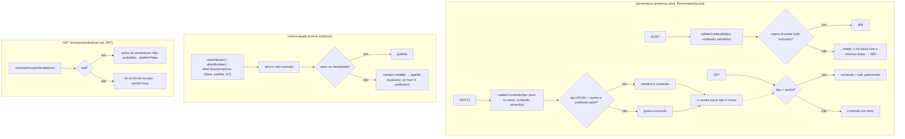

# Fluxograma — Módulos `parametros` e `escopo`

```mermaid
flowchart TD
    subgraph CRUD["/parametros (empresa ativa, PermissionsGuard)"]
      C1["POST"] --> C2["validarConteudo(tipo, conteudo, tamanho)"]
      C2 --> C3{"chave já existe (não excluída)?"}
      C3 -- sim --> C409[409]
      C3 -- não --> C4["create ⚠ excluída com a mesma chave → 500"]
      U1["PATCH"] --> U2["validarConteudo(tipo novo ou atual, conteudo, tamanho)"]
      U2 --> U3{"tipo ATUAL = senha e conteudo vazio?"}
      U3 -- sim --> U4["mantém o conteúdo"]
      U3 -- não --> U5["grava o enviado"]
      U4 & U5 --> U6["⚠ aceita trocar tipo e chave"]
      G1["GET"] --> G2{"tipo = senha?"}
      G2 -- sim --> G3["conteudo = null, preenchido"]
      G2 -- não --> G4["conteudo em texto"]
      U6 -.-> G2
    end

    subgraph Leitura["Leitura tipada (outros módulos)"]
      L1["obterNumero / obterBoolean / obterTexto(empresa, chave, padrão, tx?)"] --> L2["ativo e não excluído"]
      L2 --> L3{"vazio ou inexistente?"}
      L3 -- sim --> L4[padrão]
      L3 -- não --> L5["número inválido → padrão<br/>booleano: só 'true' é verdadeiro"]
    end

    subgraph Escopo["GET /escopo/vendedores (só JWT)"]
      E1["resolverEscopoVendedores"] --> E2{"null?"}
      E2 -- sim --> E3["todos os vendedores não excluídos · restrito=false"]
      E2 -- não --> E4["só os ids do escopo · restrito=true"]
    end
```
