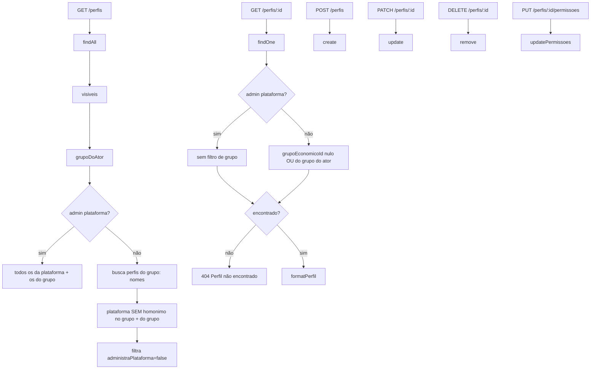
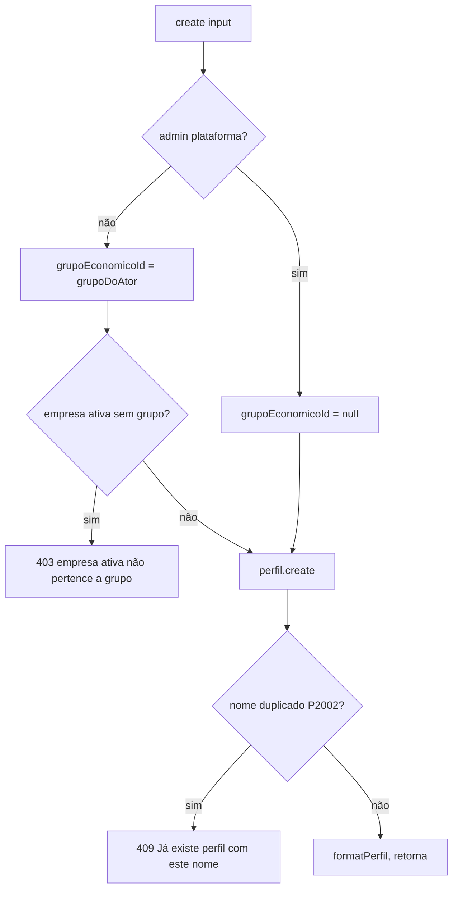
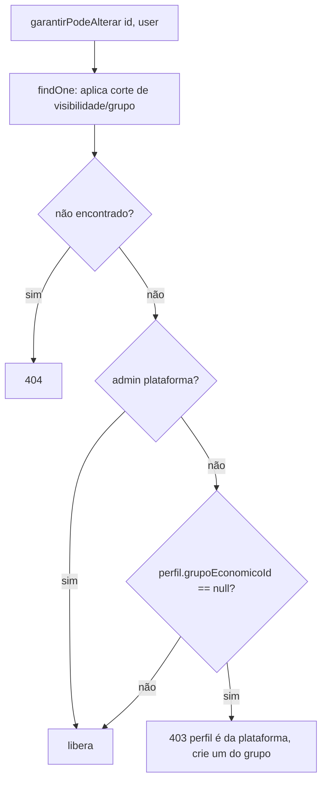
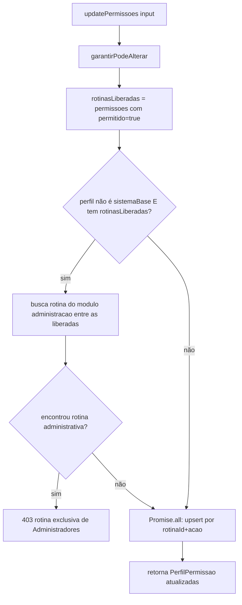

# Fluxograma — Módulo `perfis`

```mermaid
flowchart TD
    A["GET /perfis"] --> S1[findAll]
    B["GET /perfis/:id"] --> S2[findOne]
    C["POST /perfis"] --> S3[create]
    D["PATCH /perfis/:id"] --> S4[update]
    E["DELETE /perfis/:id"] --> S5[remove]
    F["PUT /perfis/:id/permissoes"] --> S6[updatePermissoes]

    S1 --> V1[visiveis]
    S2 --> V2{admin plataforma?}

    V1 --> V3[grupoDoAtor]
    V3 --> V4{admin plataforma?}
    V4 -- sim --> V5[todos os da plataforma + os do grupo]
    V4 -- não --> V6[busca perfis do grupo: nomes]
    V6 --> V7[plataforma SEM homonimo no grupo + do grupo]
    V7 --> V8[filtra administraPlataforma=false]

    V2 -- sim --> R1[sem filtro de grupo]
    V2 -- não --> R2[grupoEconomicoId nulo OU do grupo do ator]
    R1 --> R3{encontrado?}
    R2 --> R3
    R3 -- não --> X1[404 Perfil não encontrado]
    R3 -- sim --> R4[formatPerfil]
```

## `create` — detalhe

```mermaid
flowchart TD
    A[create input] --> B{admin plataforma?}
    B -- sim --> C[grupoEconomicoId = null]
    B -- não --> D[grupoEconomicoId = grupoDoAtor]
    D --> E{empresa ativa sem grupo?}
    E -- sim --> X1[403 empresa ativa não pertence a grupo]
    E -- não --> F[perfil.create]
    C --> F
    F --> G{nome duplicado P2002?}
    G -- sim --> X2[409 Já existe perfil com este nome]
    G -- não --> H[formatPerfil, retorna]
```

## `garantirPodeAlterar` — usado por update/remove/updatePermissoes

```mermaid
flowchart TD
    A[garantirPodeAlterar id, user] --> B[findOne: aplica corte de visibilidade/grupo]
    B --> C{não encontrado?}
    C -- sim --> X1[404]
    C -- não --> D{admin plataforma?}
    D -- sim --> OK[libera]
    D -- não --> E{perfil.grupoEconomicoId == null?}
    E -- sim --> X2[403 perfil é da plataforma, crie um do grupo]
    E -- não --> OK
```

## `updatePermissoes` — detalhe

```mermaid
flowchart TD
    A[updatePermissoes input] --> B[garantirPodeAlterar]
    B --> C[rotinasLiberadas = permissoes com permitido=true]
    C --> D{perfil não é sistemaBase E tem rotinasLiberadas?}
    D -- sim --> E[busca rotina do modulo administracao entre as liberadas]
    E --> F{encontrou rotina administrativa?}
    F -- sim --> X1[403 rotina exclusiva de Administradores]
    F -- não --> G
    D -- não --> G[Promise.all: upsert por rotinaId+acao]
    G --> H[retorna PerfilPermissao atualizadas]
```
