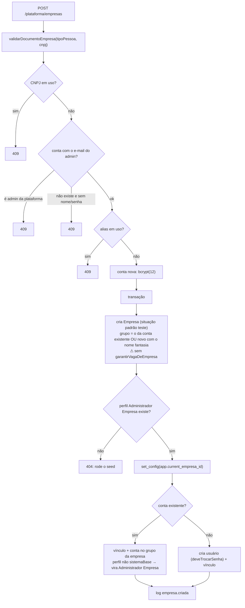

# Fluxograma — `PlataformaService.criarEmpresa`

```mermaid
flowchart TD
    I["POST /plataforma/empresas"] --> D["validarDocumentoEmpresa(tipoPessoa, cnpj)"]
    D --> C{"CNPJ em uso?"}
    C -- sim --> X1[409]
    C -- não --> E{"conta com o e-mail do admin?"}
    E -- "é admin da plataforma" --> X2[409]
    E -- "não existe e sem nome/senha" --> X3[409]
    E -- ok --> A{"alias em uso?"}
    A -- sim --> X4[409]
    A -- não --> H["conta nova: bcrypt(12)"]
    H --> T["transação"]
    T --> EMP["cria Empresa (situação padrão teste)<br/>grupo = o da conta existente OU novo com o nome fantasia<br/>⚠ sem garantirVagaDeEmpresa"]
    EMP --> PF{"perfil Administrador Empresa existe?"}
    PF -- não --> X5["404: rode o seed"]
    PF -- sim --> SC["set_config(app.current_empresa_id)"]
    SC --> K{"conta existente?"}
    K -- sim --> K1["vínculo + conta no grupo da empresa<br/>perfil não sistemaBase → vira Administrador Empresa"]
    K -- não --> K2["cria usuário (deveTrocarSenha) + vínculo"]
    K1 & K2 --> LOG["log empresa.criada"]
```
