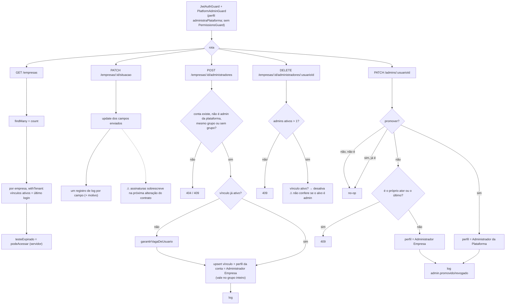

# Fluxograma — Módulo `plataforma`

```mermaid
flowchart TD
    G["JwtAuthGuard + PlatformAdminGuard<br/>(perfil administraPlataforma; sem PermissionsGuard)"] --> R{rota}

    R --> L["GET /empresas"] --> L1["findMany + count"] --> L2["por empresa, withTenant:<br/>vínculos ativos + último login"] --> L3["testeExpirado = podeAcessar (servidor)"]

    R --> SIT["PATCH /empresas/:id/situacao"] --> S1["update dos campos enviados"] --> S2["um registro de log por campo (+ motivo)"]
    S1 -.-> S3["⚠ assinaturas sobrescreve na próxima alteração do contrato"]

    R --> ADM["POST /empresas/:id/administradores"] --> V1{"conta existe, não é admin da plataforma,<br/>mesmo grupo ou sem grupo?"}
    V1 -- não --> V409[404 / 409]
    V1 -- sim --> V2{"vínculo já ativo?"}
    V2 -- não --> V3["garantirVagaDeUsuario"]
    V2 -- sim --> V4
    V3 --> V4["upsert vínculo + perfil da conta = Administrador Empresa<br/>(vale no grupo inteiro)"] --> V5[log]

    R --> DES["DELETE /empresas/:id/administradores/:usuarioId"] --> D1{"admins ativos > 1?"}
    D1 -- não --> D409[409]
    D1 -- sim --> D2["vínculo ativo? → desativa ⚠ não confere se o alvo é admin"]

    R --> PA["PATCH /admins/:usuarioId"] --> P1{"promover?"}
    P1 -- "sim, já é" --> P0[no-op]
    P1 -- "sim" --> P2["perfil = Administrador da Plataforma"]
    P1 -- "não, não é" --> P0
    P1 -- "não" --> P3{"é o próprio ator ou o último?"}
    P3 -- sim --> P409[409]
    P3 -- não --> P4["perfil = Administrador Empresa"]
    P2 & P4 --> P5["log admin.promovido/revogado"]
```
